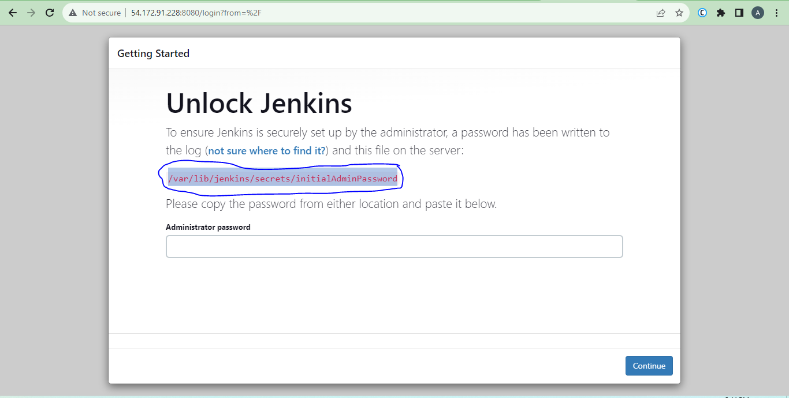
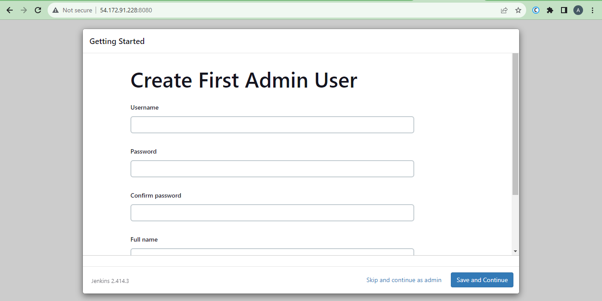
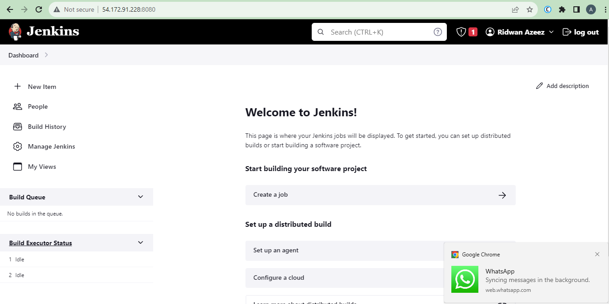
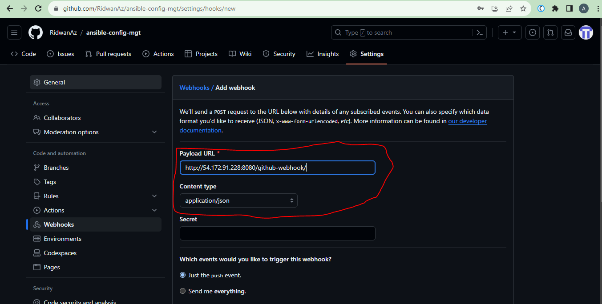
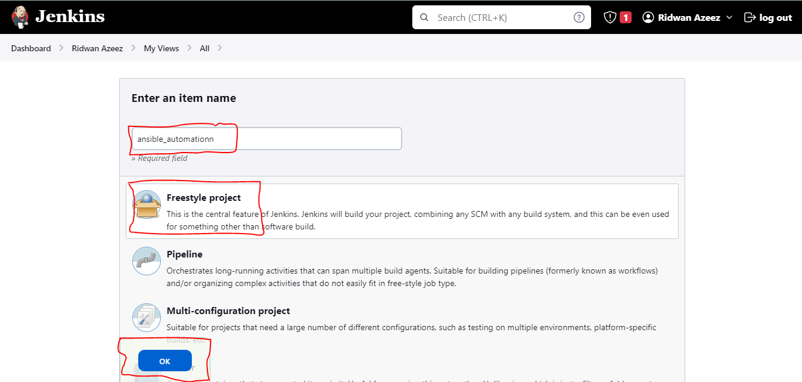
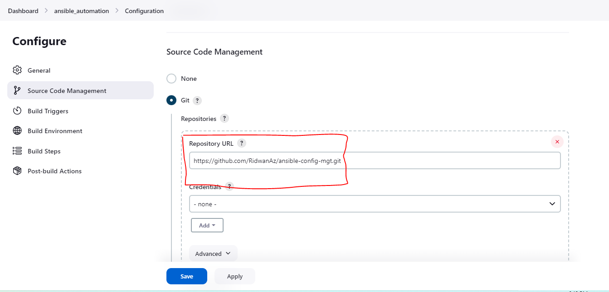
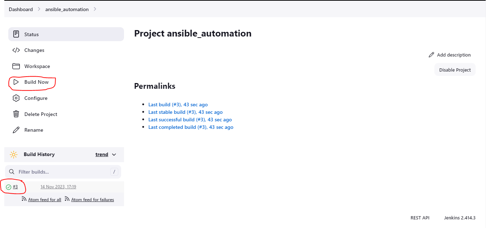

## ANSIBLE AUTOMATE PROJECT

## Introduction To Ansible
Ansible Automation is a project that helps you learn about configuration management using Ansible. This project will show learners how to make your tasks easier by automating different things like setting up the system, installing applications, and managing them. Ansible is a strong free automation tool that can make your work easier and more efficient. This project will help you understand and use Ansible for automating tasks.

### What is Ansible
Ansible is an orchestration and automation tool that allows you to define and manage your infrastructure as code, making it easier to configure and manage multiple servers, applications, and services.

As a devops engineer for your organisation, you are tasked with creating a backup directory for datas on a thousand servers, it will be a very tiring to go on each server and start creating backup directory manually. Ansible can automate the task for us with a single code that will run through the entire server

### Why Ansible Is Important For Automation
Ansible is of utmost importance in today's technology landscape. It offers a solution to the challenges faced by devops engineers, system administrators, and IT professionals in managing infrastructure efficiently. By learning Ansible, you can reduce manual errors, save time, and ensure consistency in your infrastructure. The real-world impact is significant, as it can enhance the reliability and scalability of your systems, making it a valuable skill for anyone working in the field of IT.

### Target Audience

- DevOps Engineers: To automate and streamline deployment and orchestration processes.
- System Administrators: To simplify server and configuration management.
- IT Professionals: To improve operational efficiency and reduce downtime.
Anyone interested in automation and IaC: To learn a valuable skill applicable across various industries.

### Project Prerequisites

- Basic understanding of Linux systems and command-line usage.
- Familiarity with SSH and basic server administration.
- A computer running Linux (preferably Ubuntu) or a Linux virtual machine.
- Ansible installed on your local machine or server. We will guide you through the installation process.

### Project Goals
- To understand the fundamentals of Ansible and its core concepts.
- To become proficient in writing Ansible playbooks for automation.
- To automate some devops tasks.
- To deploy and manage applications using Ansible.
- To be well-equipped to apply Ansible to real-world scenarios, improving efficiency and scalability in your IT operations.

## Project Highlight
- Ansible Automate Project

- Introduction To Ansible
  - What is Ansible
  - Why Ansible Is Important For Automation
  - Target Audience
  - Project Prerequisites
  - Project Goals

- Implementing Ansible For Automation
  - Install and Configure Ansible On EC2 Instance
  - Configure Jenkins Build Job To Archive Your Repository Content Every Time It Is Changed
  - Prepare Your Development Environment Using Visual Studio Code
  - Begin Ansible Development
  - Setup Ansible Inventory
  - Create A Common Playbook
  - Update GIT With The Latest Code
  - Run First Ansible Test

- Real Life Scenarios Using Ansible

 - Conclusion

## Implementing Ansible For Automation

### Step 1: Install and Configure Ansible on EC2 Instance
- Launch an instace and name it Jenkins-Ansible. We will install and configure jenkins and ansible on this instance.
- Create a new repository call ansible-config-mgt. This repository will be connected to jenkins pipeline and also store ansible files
- Install Ansible

      sudo apt update
      sudo apt install ansible
  ***Confirm Ansible has been successfully installed***

      ansible --version

### Step 2: Configure Jenkins Build Job To Archive Your Repository Content Every Time It Is Changed
Jenkin is a pipeline for continuous integration. To create a build job, we need to have jenkins installed and configured first.
- On the same EC2 instance ansible was installed, we need to install jenkins
*** Update package repositories

      sudo apt update
***Install JDK***

    sudo apt install default-jdk-headless
***Install Jenkins***

    wget -q -O - https://pkg.jenkins.io/debian-stable/jenkins.io.key | sudo apt-key add -
    sudo sh -c 'echo deb https://pkg.jenkins.io/debian-stable binary/ > \
    /etc/apt/sources.list.d/jenkins.list'
    sudo apt update
    sudo apt-get install jenkins
***Check if jenkins has been installed, and it is up and running***

    sudo systemctl status jenkins

 
 

***On our Jenkins-Ansible instance, create new inbound rules for port 8080 in security group***

***Set up Jenkins***

i. Input your Jenkins-Ansible Instance ip address on your web browser i.e. http://public_ip_address:8080

ii. On your Jenkins-Ansible instance, check  "/var/lib/jenkins/secrets/initialAdminPassword" to know your password.

iii. Installed suggested plugins

iv. Create a user account 

v. Log in to jenkins console

***Confiure Jenkins To Receive Source Code From ansible-cofig-mgt***

i. Allow webhook in our github repository. In ansible-config-mgt repository, navigate to **settings>webhooks** and past the url of jenkins.

ii. Create a freestyle project in your jenkins web account and name it "ansible_automation"

iii. Connect jenkins to ansible-config-mgt repository by pasting the repository url in the area selected below

iv. Save configuration and run "build now" to connect jenkins to our repository

v. Click "Configure" your job and add these two configurations

Configure triggering the job from GitHub webhook and Configure "Post-build Actions" to archive all the files.

click on add post-build actions and click "Archive the Artifact" then save

Now, go ahead and make some change in any file in your GitHub repository (e.g. README.MD file) and push the changes to the master branch.

You will see that a new build has been launched automatically (by webhook) and you can see its results – artifacts, saved on Jenkins server.

### Step 3:  Prepare your development environment using Visual Studio Code
1. First part of 'DevOps' is 'Dev', which means you will require to write some codes and you shall have proper tools that will make your coding and debugging comfortable - you need an Integrated development environment (IDE) or Source-code Editor. There is a plethora of different IDEs and source-code Editors for different languages with their own advantages and drawbacks, you can choose whichever you are comfortable with, but we recommend one free and universal editor that will fully satisfy your needs - Visual Studio Code (VSC), you can get it here.

2. After you have successfully installed VSC, configure it to connect to your newly created GitHub repository.

3. Clone down your ansible-config-mgt repo to your Jenkins-Ansible instance. See [Project 1](https://github.com/RidwanAz/Darey.io_Devops_Project/blob/0ce5355a44b1709e01334537053a23fd480da176/Git_project/Git.md) step V to learn more about clonning git repositories.

### Step 4: - Begin Ansible Development
i. In your ansible-config-mgt GitHub repository, create a new branch "feature" locally that will be used for development of a new feature.

ii. Checkout the newly created feature branch to your local machine and start building your code and directory structure

iii. Create a directory and name it playbooks - it will be used to store all your playbook files.

iv Create a directory and name it inventory - it will be used to keep your hosts organised.

v. Within the playbooks folder, create your first playbook, and name it common.yml

vi. Within the inventory folder, create an inventory file () for each environment (Development, Staging Testing and Production) dev, staging, uat, and prod respectively. These inventory files use .ini languages style to configure Ansible hosts.

### Step 5: Setup Ansible Inventory 

In Ansible, an inventory file is a simple text file that defines the hosts and groups of hosts that Ansible can manage. It serves as a source of truth for Ansible to know which hosts it should target when running tasks and playbooks. The inventory file is a fundamental concept in Ansible and is used to organize and manage your infrastructure.

We need setup our ssh keys for ansible so it can have access to our host (remote servers) when running playbooks for our hosts.

This can be done using an SSH agent. An SSH agent allows you to securely store and manage your SSH private keys and provides a convenient way for ansible to authenticate with remote hosts without repeatedly entering your SSH key.

    eval `ssh-agent -s`
    ssh-add <path-to-private-key>
Confirm the key has been added with the command below, you should see the name of your key

    ssh-add -l 

Since we have our SSH key for our host stored with SSH agent so ansible can use this, ansible also need to know the host to manage. We can do this with an inventory file

i. Open the inventory/dev.yml file we created earlier
    
    sudo nano /inventory/dev.yml
ii. Paste the below information

    [nfs]
    ansible_host=<NFS-Server-Private-IP-Address> ansible_ssh_user=ec2-user

    [webservers]
    ansible_host=<Web-Server1-Private-IP-Address> ansible_ssh_user=ec2-user
    ansible_host=<Web-Server2-Private-IP-Address> ansible_ssh_user=ec2-user

    [db]
    ansible_host=<Database-Private-IP-Address> ansible_ssh_user=ec2-user 

    [lb]
    ansible_host=<Load-Balancer-Private-IP-Address> ansible_ssh_user=ubuntu

### Step 6: - Create a Common Playbook
It is time to start giving Ansible the instructions on what you need to be performed on all servers listed in inventory/dev.

In common.yml playbook you will write configuration for repeatable, re-usable, and multi-machine tasks that is common to systems within the infrastructure.

Update your playbooks/common.yml file with following code:

    ---
    - name: update web, nfs and db servers
      hosts: webservers, nfs, db
      become: yes
      tasks:
        - name: ensure wireshark is at the latest version
          yum:
            name: wireshark
            state: latest
   

    - name: update LB server
      hosts: lb
      become: yes
      tasks:
        - name: Update apt repo
          apt: 
            update_cache: yes

        - name: ensure wireshark is at the latest version
          apt:
            name: wireshark
            state: latest
Examine the code above and try to make sense out of it. This playbook is divided into two parts, each of them is intended to perform the same task: install wireshark utility (or make sure it is updated to the latest version) on your RHEL 8 and Ubuntu servers. It uses root user to perform this task and respective package manager: yum for RHEL 8 and apt for Ubuntu.

Feel free to update this playbook with following tasks:

Create a directory and a file inside it
Change timezone on all servers
Run some shell script

### Step 7: - Update GIT with the latest code
Now all of your directories and files live on your machine and you need to push changes made locally to GitHub.

In the real world, you will be working within a team of other DevOps engineers and developers. It is important to learn how to collaborate with help of [GIT]((https://github.com/RidwanAz/Darey.io_Devops_Project/blob/0ce5355a44b1709e01334537053a23fd480da176/Git_project/Git.md)). In many organisations there is a development rule that do not allow to deploy any code before it has been reviewed by an extra pair of eyes - it is also called "Four eyes principle".

Now you have a separate branch, you will need to know how to raise a Pull Request (PR), get your branch peer reviewed and merged to the master branch.

Commit your code into GitHub:

Use git commands to add, commit and push your branch to GitHub.
    
    git status
    git add <selected files>
    git commit -m "commit message"

push changes to a remote repositories

    git push
Wear the hat of another developer for a second, and act as a reviewer.

If the reviewer is happy with your new feature development, merge the code to the master branch on your local computer, commit and push changes to your remote repository.

Once your code changes appear in master branch - Jenkins will do its job and save all the files (build artifacts) to /var/lib/jenkins/jobs/ansible/builds/<build_number>/archive/ directory on Jenkins-Ansible server as we configured it to in **Step 2**

### Step 8: - Run first Ansible test
Now, it is time to execute ansible-playbook command and verify if your playbook actually works:

Setup your VSCode to connect to your instance as demonstrated by the video above. Now run your playbook using the command:
    
    cd ansible-config-mgt
    
    ansible-playbook -i inventory/dev.yml playbooks/common.yml
    

Note: Make sure you're in your ansible-config-mgt directory before you run the above command.

You can go to each of the servers and check if wireshark has been installed by running which wireshark or wireshark --version

### Side Study
Learners should look into Ansible Modules to deepen knowledge of ansible playbooks. Ansible Modules are the building blocks of Ansible playbooks, and understanding them is fundamental to working effectively with Ansible.

## Real Life Scenarios Using Ansible
In a DevOps scenario, you want to implement a CI/CD pipeline for your project. Ansible can play a crucial role in this process. You can use Ansible to automate the provisioning and configuration of testing and production environments. This ensures that your CI/CD pipeline is reliable and reproducible, allowing you to deliver software updates to your users with confidence.

## Conclusion
Ansible Automation is a powerful tool that can simplify and streamline various aspects of IT and infrastructure management. This project also covered jenkin for integration. By learning Ansible and Jenkins, you can automate tasks, reduce manual errors, and ensure consistency in your operations. Key takeaways from this project include:
Understanding the fundamentals of Ansible and its use cases.
Proficiency in writing Ansible playbooks to automate tasks.
The ability to apply Ansible in scenarios such as server configuration, application deployment, and CI/CD pipelines.

