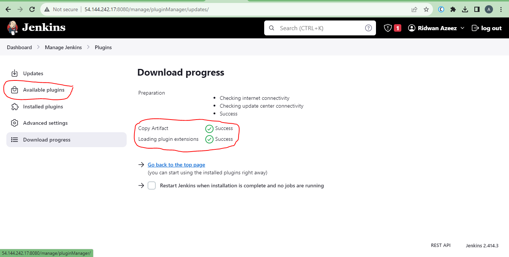
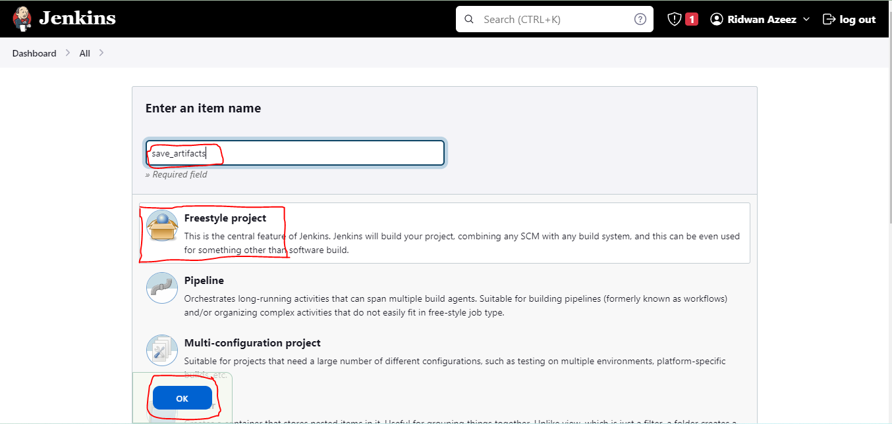
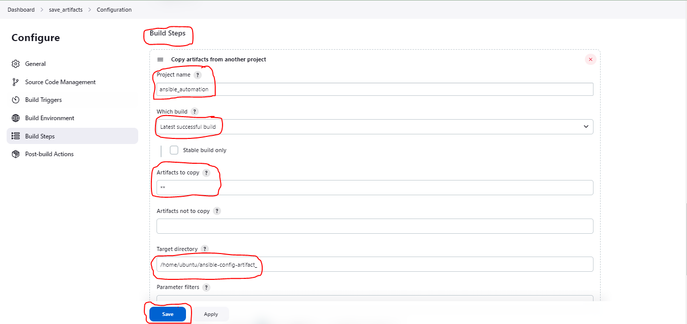
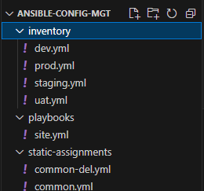
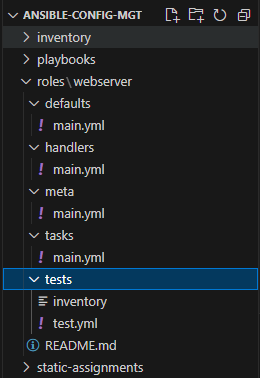
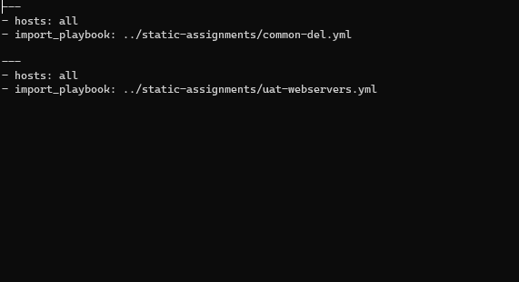
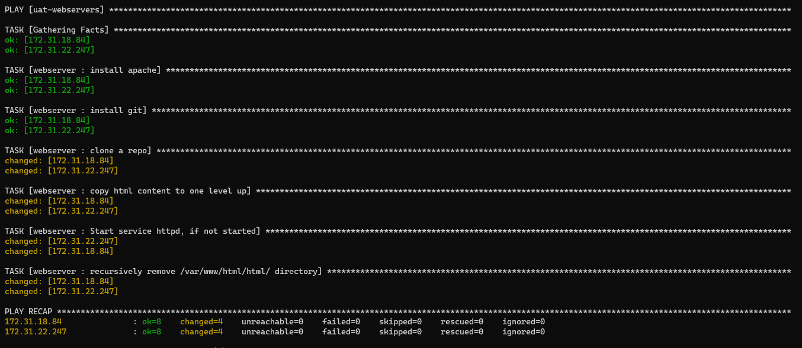
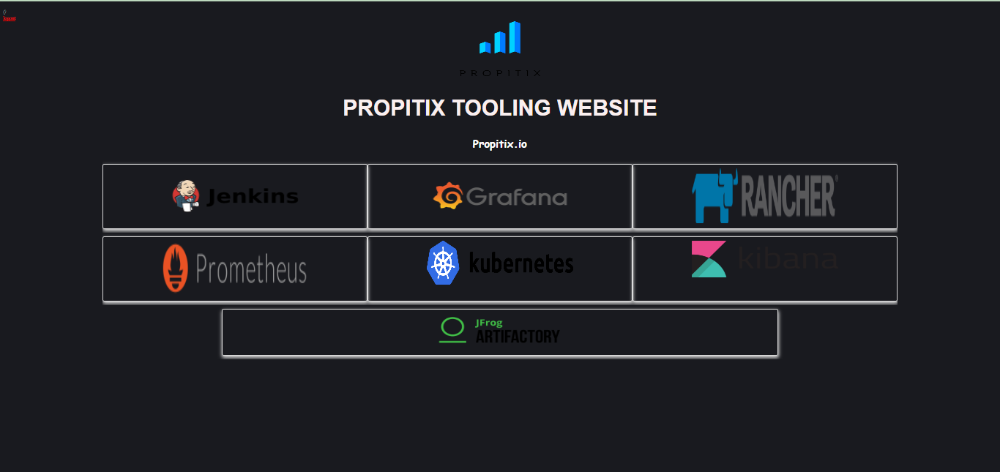

## ANSIBLE REFACTORING, ASSIGNMENTS AND IMPORTS

## Introduction
In DevOps, efficient automation tools play a pivotal role in streamlining workflows, ensuring consistency, and managing infrastructure at scale. This project delves further into the realm of Ansible, focusing on refactoring, assignments, and imports. Understanding these concepts is essential for mastering Ansible and optimizing its usage in complex environments.

### What Is Refactoring, Assignment, And Import
This project revolves around enhancing Ansible playbooks through refactoring, assignments, and imports. Refactoring involves restructuring existing code to improve readability and maintainability, while assignments allow dynamic data handling within playbooks. Imports, on the other hand, facilitate modularization by incorporating external playbooks or roles into the main automation script.

### Importance Of Refactoring, Assignment And Imports
Effective Ansible usage is critical for organizations aiming to automate infrastructure management and application deployment. Refactoring promotes code clarity, reducing errors and easing collaboration. Assignments empower playbooks with dynamic capabilities, adapting to diverse scenarios. Imports enable the reuse of well-defined components, fostering modularity and scalability. Mastery of these concepts enhances productivity, making Ansible an indispensable asset in the DevOps toolbox.

### Target Audience
This project is tailored for DevOps engineers seeking to optimize Ansible playbooks. Familiarity with basic Ansible concepts is recommended. Users should have a foundational understanding of YAML, as Ansible playbooks are written in this format.

### Project Prerequisite
Basic knowledge of Ansible concepts and YAML syntax.
Understanding of inventory files and host configurations.
Knowledge in running Ansible commands and playbooks.
Completion of the previous project [Ansible Automate](https://github.com/RidwanAz/Darey.io_Devops_Project/blob/adf58f8ac5aecbb54814e98e589bef9664f647fc/Ansible_Automate_Project/project10.md)

### Project Goals
- Understand the principles of refactoring Ansible playbooks for improved readability and maintainability.
- Learn dynamic data handling techniques within Ansible playbooks for adaptable automation.
- Master the art of modularization by incorporating external playbooks and roles into main Ansible scripts.
- Combine refactoring, assignments, and imports to create well-organized and efficient Ansible automation solutions.

## Project Highlight
- Ansible Refactoring Assignment And Import

- Introduction
  - What Is Refactoring, Assignment And Imports
  - Importance Of Refactoring Assignment And Imports
  - Target Audience
  - Project Prerequisite
  - Project Goals

- Refactor Ansible Code By Importing Other Playbooks Into site.yml
  - Jenkins Job Enhancement
  - Refactor Ansible Code By Importing Other Playbooks Into site.yml
  - Configure UAT Webservers With A Role "Webserver"
  - Reference "Webserve" Role
  - Commit And Test

- Real Life Scenario
- Conclusions

## Refactor Ansible Code By Importing Other Playbooks Into site.yml
### Step 1: Jenkins Job Enhancement
In the previous project, we create a jenkins build job, let us make some changes to our Jenkins job. Now every new change in the codes creates a separate directory which is not very convenient when we want to run some commands from one place. Besides, it consumes space on Jenkins server with each subsequent change. Let us enhance it by introducing a new Jenkins job - we will require Copy Artifact plugin.

i. Go to your Jenkins-Ansible server and create a new directory called ansible-config-artifact - we will store there all artifacts after each build.

    sudo mkdir /home/ubuntu/ansible-config-artifact

ii. Change permissions to this directory, so Jenkins could save files there.

    chmod -R 0777 /home/ubuntu/ansible-config-artifact

iii. Go to Jenkins web console -> Manage Jenkins -> Manage Plugins -> on Available tab search for Copy Artifact and install this plugin without restarting Jenkins.

iv. Create a new Freestyle project as it was done in the previous project and name it save_artifacts. Make sure it is connected to ansible-config-mgt repository.

v. This project will be triggered by completion of your existing ansible project. Configure it accordingly

<table>
  <tr>
    <td></td>
    <td></td>
  </tr>
</table>

vi. The main idea of save_artifacts project is to save artifacts into /home/ubuntu/ansible-config-artifact directory. To achieve this, create a Build step and choose Copy artifacts from other project, specify ansible as a source project and /home/ubuntu/ansible-config-artifact as a target directory.

vii. Test your set up by making some change in README.MD file inside your ansible-config-mgt repository (right inside master branch).

### Step 2: Refactor Ansible Code By Importing Other Playbooks Into site.yml

i. Within playbooks folder, create a new file and name it site.yml - This file will now be considered as an entry point into the entire infrastructure configuration. Other playbooks will be included here as a reference. In other words, site.yml will become a parent to all other playbooks that will be developed. Including common.yml that you created previously. Don't worry, you will understand more what this means shortly.

ii. Create a new folder in root of the repository and name it static-assignments. The static-assignments folder is where all other children playbooks will be stored. This is merely for easy organization of your work. It is not an Ansible specific concept, therefore you can choose how you want to organize your work. You will see why the folder name has a prefix of static very soon. For now, just follow along.

iii. Move common.yml file into the newly created static-assignments folder.

iv. Inside site.yml file, import common.yml playbook. See [project 10](https://github.com/RidwanAz/Darey.io_Devops_Project/blob/adf58f8ac5aecbb54814e98e589bef9664f647fc/Ansible_Automate_Project/project10.md) for this playbook

    ---
    - hosts: all
    - import_playbook: ../static-assignments/common.yml
The code above uses built in import_playbook Ansible module.

Our folder structure should look like this;

        
v. Run ansible-playbook command against the dev environment
Since we need to apply some tasks to our dev servers and wireshark is already installed - we can go ahead and create another playbook under static-assignments and name it common-del.yml. In this playbook, configure deletion of wireshark utility.

    ---
    - name: update web, nfs and db servers
      hosts: webservers, nfs, db
      remote_user: ec2-user
      become: yes
      become_user: root
      tasks:
      - name: delete wireshark
        yum:
          name: wireshark
          state: removed

    - name: update LB server
      hosts: lb
      remote_user: ubuntu
      become: yes
      become_user: root
      tasks:
      - name: delete wireshark
        apt:
          name: wireshark-qt
          state: absent
          autoremove: yes
          purge: yes
          autoclean: yes
          
update site.yml with - import_playbook: ../static-assignments/common-del.yml instead of common.yml and run it against dev servers:

    cd /home/ubuntu/ansible-config-mgt/

    ansible-playbook -i inventory/dev.yml playbooks/site.yml

  
  
Make sure that wireshark is deleted on all the servers by running
    
    wireshark --version

Now we have learned how to use import_playbooks module and you have a ready solution to install/delete packages on multiple servers with just one command.

### Step 3 – Configure UAT Webservers With A Role 'Webserver'
i. Launch 2 fresh EC2 instances using RHEL 8 image, we will use them as our uat servers, so give them names accordingly – Web1-UAT and Web2-UAT.

ii. To create a role, you must create a directory called roles/, relative to the playbook file or in /etc/ansible/ directory.
There are two ways how you can create this folder structure:

Use an Ansible utility called ansible-galaxy inside ansible-config-mgt/roles directory (you need to create roles directory upfront)
    
    mkdir roles
    cd roles
    ansible-galaxy init webserver

The roles directory should look like this

iii. Update your inventory ansible-config-mgt/inventory/uat.yml file with IP addresses of your 2 UAT Web servers
    
    [uat-webservers]
    ansible_host=Web1-UAT-Server-Private-IP-Address ansible_ssh_user='ec2-user' 
    ansible_host=Web2-UAT-Server-Private-IP-Address> ansible_ssh_user='ec2-user' 

iv. In /etc/ansible/ansible.cfg file uncomment roles_path string and provide a full path to your roles directory roles_path= /home/ubuntu/ansible-config-mgt/roles, so Ansible could know where to find configured roles.

v. It is time to start adding some logic to the webserver role. Go into tasks directory, and within the main.yml file, start writing configuration tasks to do the following:

- Install and configure Apache (httpd service)
- Clone Tooling website from GitHub https://github.com/<your-name>/tooling.git.
- Ensure the tooling website code is deployed to /var/www/html on each of 2 UAT Web servers.
- Make sure httpd service is started

  Your main.yml in ansible-config-mgt/roles/webserver/default/main.yml shpuld consist of following tasks:

      ---
      - name: Install apache
      become: true
      ansible.builtin.yum:
      name: "httpd"
      state: present

      - name: Install git
      become: true
      ansible.builtin.yum:
      name: "git"
      state: present

      - name: clone a repo
      become: true
      ansible.builtin.git:
      repo: https://github.com/Tonybesto/tooling.git
      dest: /var/www/html
      force: yes

      - name: copy html content to one level up
      become: true
      command: cp -r /var/www/html /var/www/

      - name: Start service httpd, if not started
      become: true
      ansible.builtin.service:
      name: httpd
      state: started

      - name: recursively remove /var/www/html directory
      become: true
      ansible.builtin.file:
      path: /var/www/html
      state: absent
  

### Step 4 - Reference 'Webserver' Role
Within the static-assignments folder, create a new assignment for uat-webservers and name it uat-webservers.yml. This is where you will reference the role.

    ---
    - hosts: uat-webservers
      roles:
         - webserver
Remember that the entry point to our ansible configuration is the site.yml file. Therefore, you need to refer your uat-webservers.yml role inside site.yml.

So, we should have this in site.yml

    ---
    - hosts: all
    - import_playbook: ../static-assignments/common.yml

    - hosts: uat-webservers
    - import_playbook: ../static-assignments/uat-webservers.yml

### Step 5: Commit And Test
Merge you branch to master branch commit and push changes to your remote repository, make sure webhook triggered two consequent Jenkins jobs, they ran successfully and copied all the files to your Jenkins-Ansible server into /home/ubuntu/ansible-config-mgt/ directory.

Now run the playbook against your uat inventory and see what happens:
Change your working directory to our local repository

     cd /home/ubuntu
     
     ansible-playbook -i /home/ubuntu/ansible-config-mgt/inventory/uat.yml /home/ubuntu/ansible-config-mgt/playbooks/site.yml

You should be able to see both of your UAT Web servers configured and you can try to reach them from your browser:

    http://<Web1-UAT-Server-Public-IP-or-Public-DNS-Name>/index.php

    or

    http://<Web1-UAT-Server-Public-IP-or-Public-DNS-Name>/index.php

## Real Life Scenario
As a devpos engineer, imagine managing a diverse infrastructure where various components require different configurations. A monolithic Ansible playbook becomes unwieldy, making it challenging to update specific configurations without affecting the entire system.
Refactoring the playbook allows you to create modular sections for different components. Assignments enable dynamic data handling, ensuring that configurations are applied contextually. Imports come into play by incorporating specialized configuration playbooks, keeping the main playbook clean and focused. This use case demonstrates how refactoring, assignments, and imports collectively enhance configuration management.

## Conclusion
In conclusion, the Ansible refactoring, assignments, and imports project equips users with essential skills to elevate their automation game. By exploring and applying this concepts in this project in real-world scenarios, users can streamline configuration management, scale application deployment, and foster collaborative development.
