## DEVOPS TOOLING WEBSITE SOLUTION

## Introduction
In the fast-evolving landscape of technology and software development, the efficient collaboration between development and operations teams has become a critical factor for success. The integration of tools and practices under the umbrella term "DevOps" has emerged as a solution to streamline workflows, enhance communication, and accelerate the delivery of high-quality software products. The "DevOps Tooling Website Solution" is a project designed to provide a comprehensive and practical approach to implementing key DevOps tools in a cohesive web-based environment.

The "DevOps Tooling Website Solution" aims to create a centralized platform that incorporates essential DevOps tools for version control, collaboration and deployment. We will be deploying on building a  tooling website with components such as; AWS, Webserver, Database, Storage server and more. The goal is to provide a unified interface, fostering collaboration and enhancing the efficiency of DevOps workflows.

#### Importance
DevOps practices have become a cornerstone in modern software development, promoting collaboration and automation to achieve higher productivity and better-quality software. The "DevOps Tooling Website Solution" addresses the need for a consolidated environment, reducing the complexity of tool management and facilitating smoother communication between development and operations teams.


**This project is intended for DevOps engineers and anyone involved in the software development lifecycle (SDLC).**

#### Project Prequisite
Before delving into this project, learners should have a foundational knowledge of DevOps principles, version control using Git, and servers.
- Knowledge of linux
- Understanding of version control
- Familiarity with webservers
- Understanding of databases

#### Project Goals
By the end of this project, participants should be able to:

- Build a web-based platform that integrates key DevOps tools.
- Understand the relation between webservers, storage server and database
- Implement best practices for version control and deployment.


## Implementing A Tooling Website

In this project you will implement a solution that consists of following components:


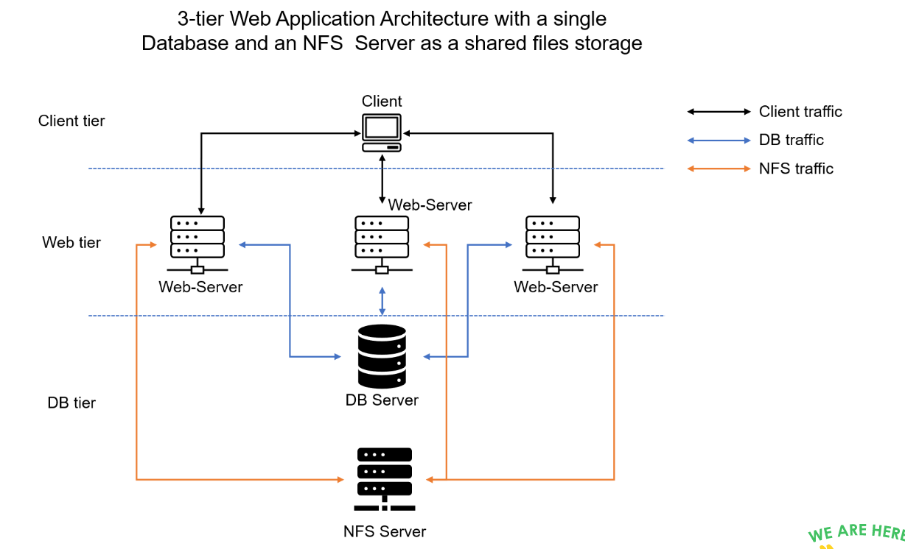


#### STEP 1 – PREPARE NFS SERVER

1. Spin up a new EC2 instance with RHEL Linux 8 Operating System.


2. Based on your LVM experience from Project 6, Configure LVM on the Server.

-  create volumes for the NFS server

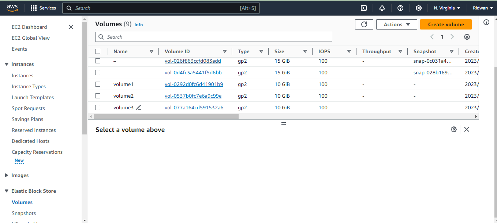


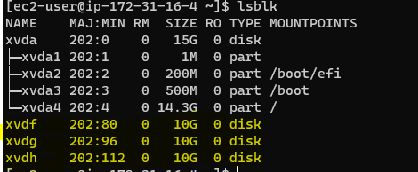

- using the gdisk utility to create partitions 


- Once partition is created install lvm2 using `sudo yum install lvm2` then carry out the other process as in the previous project.

- Create physical volume and volume group. Refer to the previous project for this.

- Use `lvcreate` to create logical volumes of size 10G, 10G and 8G each.


  
- Instead of formating the disks as `ext4` you will have to format them as `xfs`

```
sudo mkfs -t xfs /dev/webdata-vg/lv-apps
sudo mkfs -t xfs /dev/webdata-vg/lv-logs
sudo mkfs -t xfs /dev/webdata-vg/lv-opt
```


- Ensure there are 3 Logical Volumes. lv-opt lv-apps, and lv-logs

3. Create mount points on /mnt directory for the logical volumes as follow:

    Mount lv-apps on /mnt/apps – To be used by webservers

    Mount lv-logs on /mnt/logs – To be used by webserver logs

    Mount lv-opt on /mnt/opt – To be used by Jenkins server in Project 8

```
sudo mkdir /mnt/apps

sudo mkdir /mnt/logs

sudo mkdir /mnt/opt

sudo mount /dev/webdata-vg/lv-apps /mnt/apps

sudo mount /dev/webdata-vg/lv-logs /mnt/logs

sudo mount /dev/webdata-vg/lv-opt /mnt/opt
```

- Once mount is completed run **`sudo blkid`** to get the UUID of the mount part, open and paste the UUID in the fstab file.


Edit fstab file and paste the UUID of the mount part
 
      sudo vi /etc/fstab


    sudo mount -a 
    sudo systemctl daemon-reload


4. Install NFS server, configure it to start on reboot and make sure it is u and running

```
sudo yum -y update

sudo yum install nfs-utils -y

sudo systemctl start nfs-server.service

sudo systemctl enable nfs-server.service

sudo systemctl status nfs-server.service
```


5. Export the mounts for webservers’ subnet cidr to connect as clients. For simplicity, you will install your all three Web Servers inside the same subnet, but in production set up you would probably want to separate each tier inside its own subnet for higher level of security.
To check your subnet cidr – open your EC2 details in AWS web console and locate ‘Networking’ tab and open a Subnet link:

<table>
  <tr>
   <td></td>
    <td></td>
  </tr>
</table>

- Make sure we set up permission that will allow our Web servers to read, write and execute files on NFS:

```
sudo chown -R nobody: /mnt/apps

sudo chown -R nobody: /mnt/logs

sudo chown -R nobody: /mnt/opt

sudo chmod -R 777 /mnt/apps

sudo chmod -R 777 /mnt/logs

sudo chmod -R 777 /mnt/opt

sudo systemctl restart nfs-server.service
```

- Configure access to NFS for clients within the same subnet (example of Subnet CIDR – 172.31.32.0/20):

      sudo nano /etc/exports

      /mnt/apps 172.31.32.0/20(rw,sync,no_all_squash,no_root_squash)
      /mnt/logs 172.31.32.0/20(rw,sync,no_all_squash,no_root_squash)
      /mnt/opt 172.31.32.0/20(rw,sync,no_all_squash,no_root_squash)

Save and close the file.

    sudo exportfs -arv


6. Check which port is used by NFS and open it using Security Groups (add new Inbound Rule)

        rpcinfo -p | grep nfs


**Important note: In order for NFS server to be accessible from your client, you must also open following ports: TCP 111, UDP 111, UDP 2049**


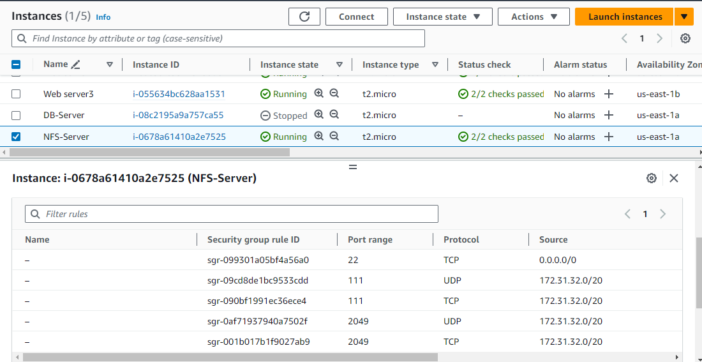

#### STEP 2 –  CONFIGURE THE DATABASE SERVER

1. Install MySQL server

        sudo apt install mysql

2. Create a database and name it `tooling`
   
        sudo mysql
        create database tooling;


3. Create a database user and name it `webaccess`

**`create user 'webaccess'@'172.31.32.0/20' identified by 'mypasskey';`**

4. Grant permission to webaccess user on tooling database to do anything only from the webservers subnet cidr

**`grant all privileges on tooling.* to 'webaccess'@'172.31.80.0/20';`**

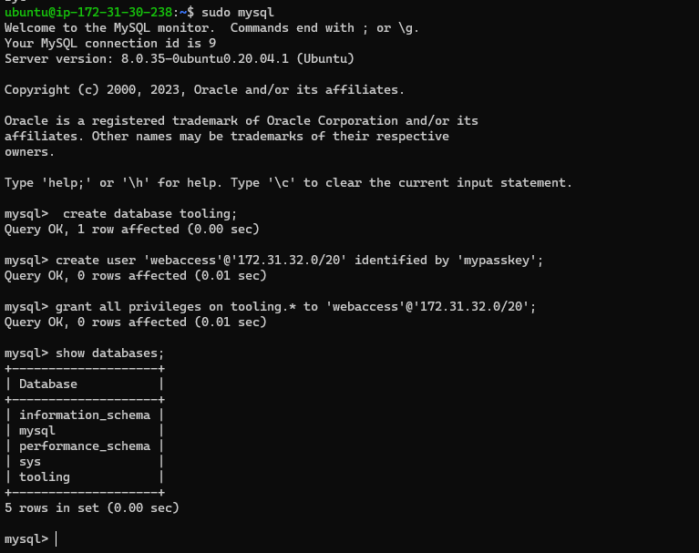


#### STEP 3 - PREPARE THE WEB SERVERS

During the next steps we will do following:

- **Configure NFS client (this step must be done on all three servers)**

- **Deploy a Tooling application to our Web Servers into a shared NFS folder**

- **Configure the Web Servers to work with a single MySQL database**


1. Launch three new EC2 instance with RHEL 8 Operating System


2. Install NFS client

`sudo yum install nfs-utils nfs4-acl-tools -y`

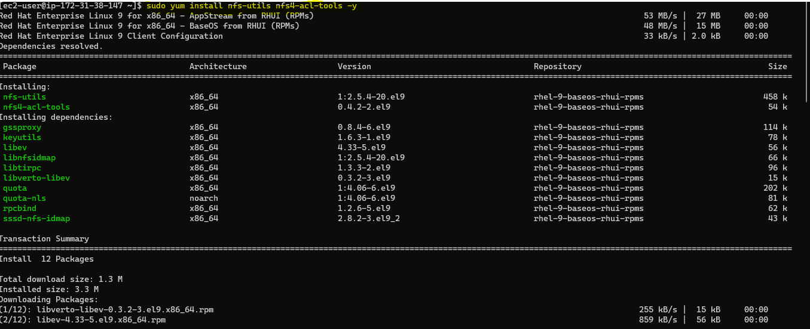

3. Mount /var/www/ and target the NFS server’s export for apps
```
sudo mkdir /var/www
sudo mount -t nfs -o rw,nosuid <NFS-Server-Private-IP-Address>:/mnt/apps /var/www
```


4. Verify that NFS was mounted successfully by running df -h. Make sure that the changes will persist on Web Server after reboot:


    sudo nano /etc/fstab

add following line;

    <NFS-Server-Private-IP-Address>:/mnt/apps /var/www nfs defaults 0 0

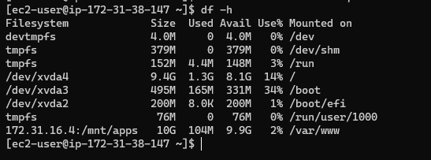

5. Install Remi’s repository, Apache and PHP
```
sudo yum install httpd -y

sudo yum install https://dl.fedoraproject.org/pub/epel/epel-release-latest-8.noarch.rpm

sudo yum install dnf-utils http://rpms.remirepo.net/enterprise/remi-release-8.rpm

sudo yum module  list php -y

sudo yum module reset php -y

sudo yum module enable php:remi-7.4 -y

sudo yum install php php-opcache php-gd php-curl php-mysqlnd -y

sudo systemctl start php-fpm

sudo systemctl enable php-fpm

sudo setsebool -P httpd_execmem 1

sudo systemctl restart httpd

```

***steps 1-5 for should be done for webserver 1, 2 and 3***

6. Verify that Apache files and directories are available on the Web Server in /var/www and also on the NFS server in /mnt/apps. If you see the same files – it means NFS is mounted correctly. You can try to create a new file touch test.txt from one server and check if the same file is accessible from other Web Servers.


7. Locate the log folder for Apache on the Web Server and mount it to NFS server’s export for logs. Repeat step 4 under the 'prepare web servers' to make sure the mount point will persist after reboot.


8. Fork the tooling source code from Darey.io Github Account to your Github account.

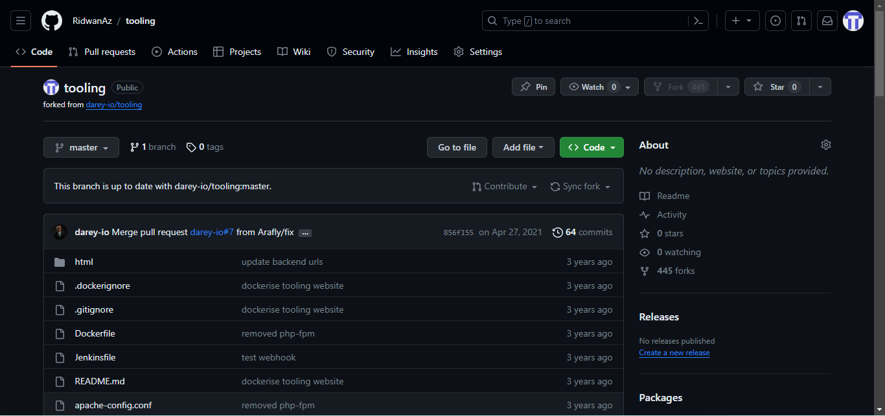

9. Deploy the tooling website’s code to the Webserver. Ensure that the html folder from the repository is deployed to `/var/www/html`


10. Copy all content inside the html folder into /var/www/html.


        sudo cp -R html/. /var/www/html


**Note 1: Do not forget to open TCP port 80 on the Web Server.**

Note 2: If you encounter 403 Error – check permissions to your `/var/www/html` folder and also disable SELinux `sudo setenforce 0`

To make this change permanent – open following config file `sudo vi /etc/sysconfig/selinux` and set `SELINUX=disabled` then restart httpd.

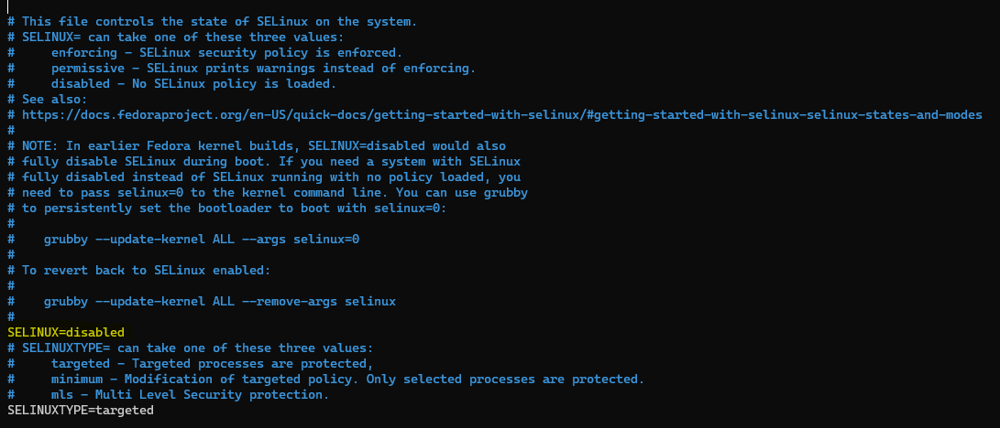

```
sudo systemctl restart httpd
sudo systemctl status httpd
```

10. Update the website’s configuration to connect to the database (in /var/www/html/functions.php file). Apply tooling-db.sql script to your database using this command mysql -h <databse-private-ip> -u <db-username> -p <db-pasword> < tooling-db.sql

        $db = mysqli_connect('172.31.30.238', 'webaccess', 'mypasskey', 'tooling');

- Install MySQL on the web servers using `sudo yum install mysql -y` then cd into the tooling directory to connect to thhe database.

       sudo mysql -h 172.31.30.238 -u webaccess -p tooling < tooling-db.sql

If you can't connect to it and there is an error simply move to the DB server to edit the inbound security group.

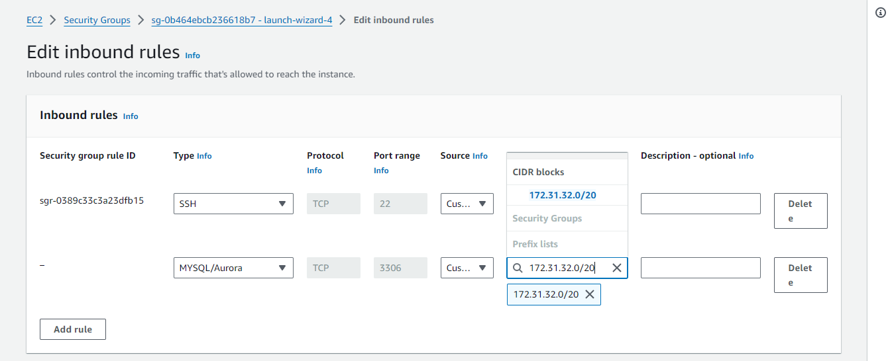

Then edit the mysqld.cnf file

    sudo vi /etc/mysql/mysql.conf.d//mysqld.cnf

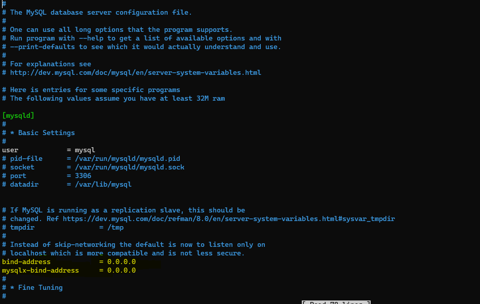


    sudo systemctl restart mysql

    sudo systemctl status mysql


11. Create in MySQL a new admin user with username: myuser and password: password:

INSERT INTO ‘users’ (‘id’, ‘username’, ‘password’, ’email’, ‘user_type’, ‘status’) VALUES
-> (1, ‘myuser’, ‘5f4dcc3b5aa765d61d8327deb882cf99’, ‘user@mail.com’, ‘admin’, ‘1’);

12. Open the website in your browser http://<Web-Server-Public-IP-Address-or-Public-DNS-Name>/index.php and make sure you can login into the websute with myuser user.

<table>
  <tr>
   <td></td>
    <td></td>
  </tr>
</table>


