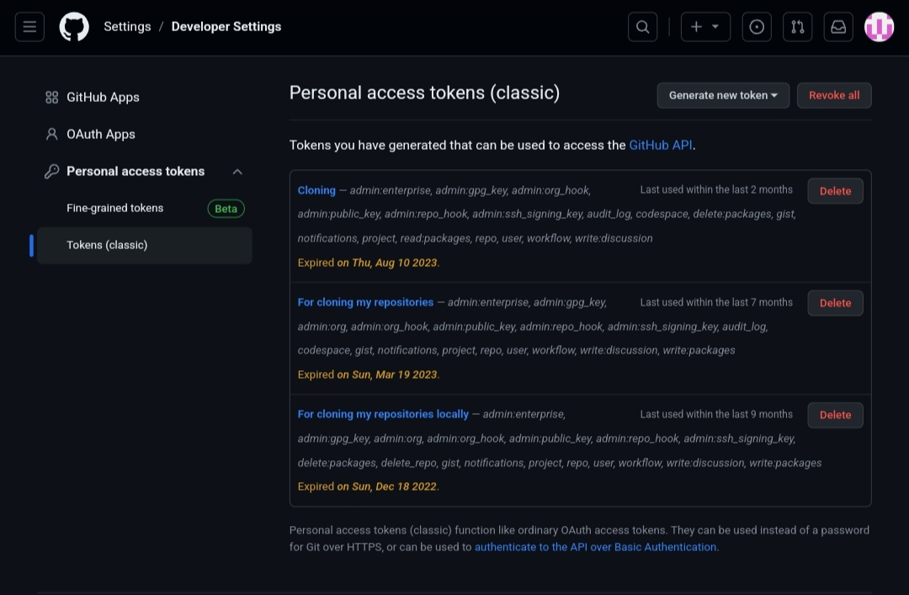

# Git & Github 
### What is Git ? 🤔
The simple definition is that it is a version control system. A version control system is a software tool that helps manage and track changes to files and directories in a project over time. It is a crucial tool for devops engineers.
### What is Github.
 Github is a code repository when all code changes are kept. It is a tool for version control and increases collaboration among cross functions team.

# Implementation of Git & Github
### Creating a Github account
click [here](https://github.com) to create an account 
### Installing Git in your local environment or virtual machine, for example vagrant
Update apt repositories 

       sudo apt update 
 For windows users, install git bash or vocoder
 For Mac users

     brew apt update
     brew install git
Install git 
      
       sudo apt install git 

Confirm installation of git by running the below command

       git --version 

### Creating a repository
Create a folder or directory in your local environment 

    sudo mkdir darey_io
initialize the folder into a repository

    git init
create a readme.md file

    echo "Welcome to darey.io" >> README.md
 Add changes 

    git add .
 Save Changes

     git commit -m "This is my first commit"
 Change your working branch to main from master

     git branch  -M main
 In order to push changes to the remote repository on github, we need the http link of the remote location.

     git remote origin -v
 Add remote origin before pushing changes.

     git remote add origin https://github.com/Ridwan010/darey_io.git
 Push Changes to your github account 

     git push -u origin main
***Note: After pushing changes to github, a prompt will be brought up asking for your username and password to your github account in order to push changes.***

### Creating a personal access token (PAT)
Personal Access Token is a form of authentication that is used to access a Github account from the command line using Git. It give access to repository locally and server as a more secure way to access a github account by replacing the username and password.
With the help of a PAT, we can eliminate the prompt showing up after pushing saved changes 
to github. The steps below shows how to create a PAT

Click on the top right corner

Select settings from dropdown

Select Developer Settings

Select personal access token 

Select Token(classic)

Click on Generate new token to generate a new one

Your PAT should be stored safely and cannot be shared with anyone. Store somewhere you can only access it once after it is generated.
### Creating a repository on github 

### Clonning to the repository
The format for clonning to a repository locally 

    Git clone <repository url>

Clonning to the repository created.

    git clone https://<PAT>@github.com/Ridwan010/Darey.io.git

### Committing and Pushing changes to a repository 
Changes made in a github repository can be committed locally and then later pushed into a remote repository on github.
Create a non empty file in the cloned github repository.

    echo "## This is my first repository as a devops engineer" > Readme.md
Add Changes made 

    git add .

Commit Changes 

    git commit -m "This is my first commit"
Push Changes to remote github repository 

    git push

    
### Working with branches
There are primarily to types of branches on github which are the master and main branch. The main branche is the default branch on github and often the primary branch on github.
Listing available branch in your local repository 

    git branch 
Switching to the master branch
![git]

    git checkout master
Switching to the main branch from the master branch

    git checkout main
Creating a new branch

    git checkout -b darey_io
The "-b" allows to switch to darey_io branch after it is created.

