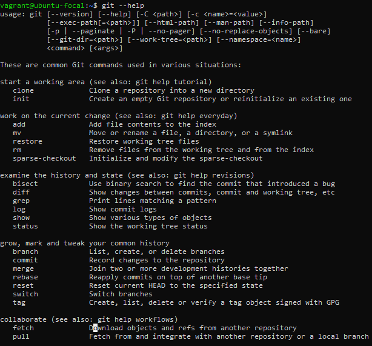
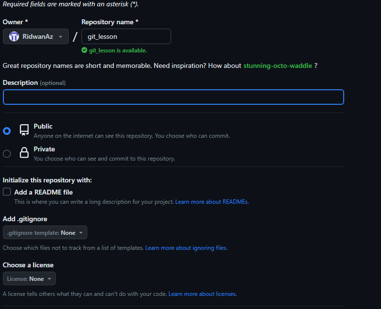
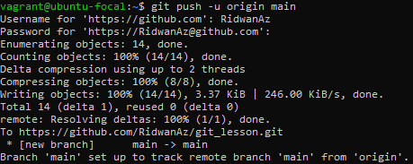

# Git

# Introduction To Git
Version control may be a basic angle of present day software development, empowering teams to collaborate efficiently, track changes, and keep up a verifiable record of their work. Git, a  common version control system, has ended up as the most popularly used within the software development industry. This project is about understanding and utilizing Git.

### What is Git ? 🤔
The simple definition is that git is a version control system. A version control system is a software tool that helps manage and track changes to files and directories in a project over time. It is an important tool for devops engineers. Git is an effective tool that helps developers run their source code effectively. It permits different people or teams to work on the same project  without clashes. 
This project aim to present the world of Git, covering everything from the essentials to more advanced points. You'll learn how to make repositories, commit changes, clone repositories, merge branches, create personal access token for commit made locally and collaborate successfully with others. 

### Importance of Git
The knowledege of git is needed by anyone into software development and deployment, ranging but no limited from developers to devops engineers, project managers, system administrator. Some of the benefit of using git are;

- Collaboration: Git allows teams to work collaboratively. In the devops lifecycle software development and deployment usually require teams to work together. For example, developers push code changes to a remote repository, QA engineer pull the code changes for testing and operations engineer deploy code changes into production using git.
- Version History: Git maintains a detailed history of changes, therefore, it makes it easy to track who made changes, what changes they made and when the changes were made.
- Branching and Merging: Git's branching and merging capabilities make it possible for development team to create other branches separate from the main codebase to work on new software version, features or fix bugs in previous release version before integraging them into the main codebase.
- Distributed Development: Git allows for distributed development, meaning team members can work on their copies of the code and merge changes later, even when not connected to the internet.
- Open Source Collaboration: Many open-source projects use Git, so understanding it is essential for contributing to or maintaining open-source software.

### Target Audience

This project is suitable for a wide range of professionals in different tech industry which are:

- Devops Engineers: Git is needed by devops engineers for tracking changes made to source code, collaborate on project, deploy code to production, manage infrastructure and resources
- Software Developers: Git is an esssential tool for the management of source code, and developers of all levels can benefit from mastering it.
- Project Managers: Understanding Git helps project managers track progress and coordinate team efforts efficiently.
- System Administrators: Git is not limited to code; it can be used to manage configurations, scripts, and documentation, making it valuable for system administrators.
- Data Scientists: Git is useful for managing data science projects and collaborating with colleagues on research.

### Prerequisites

Learners should have;
- Basic understanding of linux and its commands.
- A code editor or IDE of their choice
    - Emacs, vim or nano for linux users.
    - Visual Studio Code for Windows and Mac Users
- Access to Git installed on their system.
- A github account create [one](https://github.com)
  
No prior experience with Git is required.

### Git Goals:

By the end of this project, learners  would;
- Fully understand the basics of Git, including repositories, commits, and branches.
- Effciently use git commands like git init, git add, git commit, git remote, git push, git pull, git clone e.t.c.
- Collaborate effectively with others people or team using Git.
- Implement branching strategies to organize and manage code changes.

This project is designed to equip learners with the knowledge and skills needed to confidently use Git in  professional and personal projects, regardless of your role in the tech industry.

# Table of Contents
- Git

- Introduction To Git
  - What is Git
  - Importance of Git
  - Target Audience
  - Prerequsites
  - Git Goals

- Getting Started With Git
  - Installing Git
    - Windows
    - Linux
    - Mac

  - Git Commands

  - Concepts
    - Repositories
    - Commits
    - Branches
    - Working With Remote Repositories for Collaboration
    - Clonning Remote Git Repositories
       
- Best Practices

- Use Cases

- Conclusion

# Getting Started With Git

#### a. Installing Git
***i. Windows***
    
Download [git](https://gitforwindows.org/) installer for windows

***ii. For Linux***
Commands for installation of git depends on the linux distribution package manager

- For Ubuntu or Debian ditribution

       sudo apt update 
       sudo apt install git
The commands above will update package list and install git using apt with super user privileges.

- For Red Hat or CentOS distribution packages

        sudo yum update
        sudo yum install git
  The commands above will update package list and install git using yum with super user privileges.
  
***iii. For Mac***

 On mac operating systems, git can be install by using Homebrew
    Launch a terminal and run the below commands
    
     /bin/bash -c "$(curl -fsSL https://raw.githubusercontent.com/Homebrew/install/HEAD/install.sh)"
     brew install git 
The first command above will install homebrew and the later will install git using brew.

Confirm installation of git by running the below command

       git --version 

#### b. Git commands

Before diving further into git, below are some basic git commands which would be used for implementation as we move on;

***git add:*** add files or folder that are to be commited to your repository to a staging area

***git  commit:*** record changes to the repository

***git push:*** update changes made in a local repository to remote repository

***git init:*** creates an empty git repository or initializes an exixting one

***git pull:*** fetch changes fo=rom a remote repository to a local branch

***git --version:*** checks the installed git version.

***git config --global user.name "Your Name":*** Set your global Git username.

***git config --global user.email "youremail@example.com":*** Set your global Git email.

To know  more detailed explanation of Git commands and their usage, run;

    git --help

#### c. Concepts

***i. Repositories***

Git repos are where files are stored temporarily before they are pushed to a remote repository
 
    sudo mkdir darey_io
    cd darey_io
    echo "Welcome to darey.io" >> README.md
    git init
 The commands above;   
- Create a folder or directory in your local environment,
- move into the directory
- create a README.md file
- initializes the folder into a repository

 ***Task 1: Create a folder for called darey_io, add a README.md file containing "This is my first repository as a devops engineer" in the folder, and make the folder a git repository.***

***ii. Commits*** 

     git add README.md
     git config --global user.name "Your Name"
     git config --global user.email "youremail@example.com"
     git commit -m "This is my first commit as a devops engineer"
     
- Add the README.md file created in the previous step to a staging area
- Set your global Git username
- Set your global Git email and;
- Commit changes

***Task 2 - Make your first commit  to the from the git repo in task 1 with the commit message "Learning and growing as a devops engineer"*** 

***iii. Branches***

Git branches are ways to separte changes made to a repository from the master or main branch. There are primarily to types of branches on github which are the master and main branch. The main branche is the default branch on github and often the primary branch on github.
Listing available branch in your local repository 

    git branch 
    git checkout -b main

- List the available branches
- Create a main branch and switch to the branch. The "-b" allows to switch to main branch after it is created, otherwise, it would just create the branch without switching to it

  

  - To switch to anoher branch

        git checkout branch
    - Merging branches
      
   Merging branches is very important in git. It allows addition of changes made separately to the main codebase.

          git merge master

  The git command above merge the master branch while in the main branch
    
  - To delete a branch

        git branch -d <branch_name>

***Task 3 - create a branch called "collaboration", switch to the branch and create 3 non empty .txt files. Merge the collaboration branch to the main branch***

***iv. Working with Remote Repositories for Collaboration***

In the previous steps, we have created repositories locally, made commit to the repository, and also add branches to the reposirtory. In this step, we will be working with github as a remote repository.
Github is a code repository where all code changes made locally are kept remotely. It is a tool for version control and increases collaboration among cross functions team. Github will server as a code base where all changes made different people in a team or different teams track and manage changes made.

- Creating a Github account
click [here](https://github.com) to create an account if you do not have one.
- Creating a repository
  Create a public repository in your github account
  

- Creating a personal access token (PAT)
As of August 13, 2021, authentication with password was disabled by github, personal access tokesn is used instead of password. Personal Access Token is a form of authentication that is used to access a Github account from your local environmrnt using Git. It give access to repository locally and server as a more secure way to access a github account by replacing the username and password.
With the help of a PAT, we can eliminate the prompt showing up after pushing saved changes to github. The steps below shows how to create a PAT

Click on the top right corner

Select settings from dropdown

Select Developer Settings

Select personal access token 

Select Token(classic)

Click on Generate new token to generate a new one

Your PAT should be stored safely and cannot be shared with anyone. Store somewhere you can only access it once after it is generated.

  
- Pushing changes made locally to our remote repository
So far we have created a git repository which we made changes to locally and also made a github remote repository to py=ush our changes to. Now we will push our changes to our remote repository.

      git remote add origin https://github.com/RidwanAz/git_lesson.git
      git branch -M main
      git push -u origin main

This command adds a new remote repository called origin with the URL https://github.com/RidwanAz/git_lesson.git, pushes the current branch (main) to the remote repository origin and sets the upstream branch to main.

Note that "Password for 'https://RidwanAz@github.com': <PAT>" PAT should be replaced with our personal access token

***v. Clonning a Remote Git Repository***

The syntax for clonning to a repository locally 

    Git clone <repository url>

Clonning to the repository created.

    git clone https://<PAT>@github.com/Ridwan010/Darey.io.git

Replace you personal access token with the <PAT> when clonning your repository. The will eliminate a prompt showing while pushing changes to github

***Task 4 - Create a remote repository and push changes made from task 1 - task 3***

***Task 5 - Create a remote repository called "git_course", create a README.md file remotely, clone the remote repository***

# Best Practices
Commit Frequently: Make small, focused commits to track changes effectively.
Use Descriptive Messages: Write clear commit messages that explain the changes made.
Branch Strategically: Adopt a branching strategy like Gitflow to manage feature development and releases.
Pull Before Push: Always pull the latest changes from the remote repository before pushing your own changes.
For more best practices, refer to Git Best Practices.

# Use Cases
#### Use Case 1: Feature Development
Imagine you're developing a new feature for your project. You can create a feature branch, work on it, and merge it back into the main branch when it's ready.

#### Use Case 2: Bug Fix
Suppose a critical bug surfaces in your application. Create a bug-fix branch, fix the issue, and merge it into the main branch to deploy the fix.

# Conclusion
In this doucumentation, we have implemented essentials of Git installation, basic commands, core concepts, side hustle tasks, advanced topics, best practices, and use cases. Git is a powerful tool that empowers collaborative development and version control. Continue exploring Git's rich feature set and expand your expertise in this fundamental aspect of modern software development.

