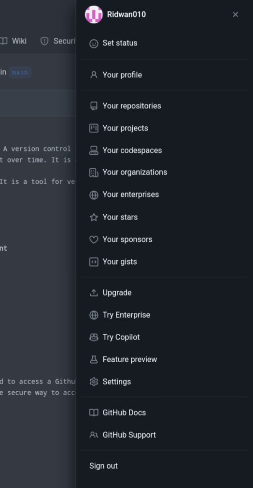
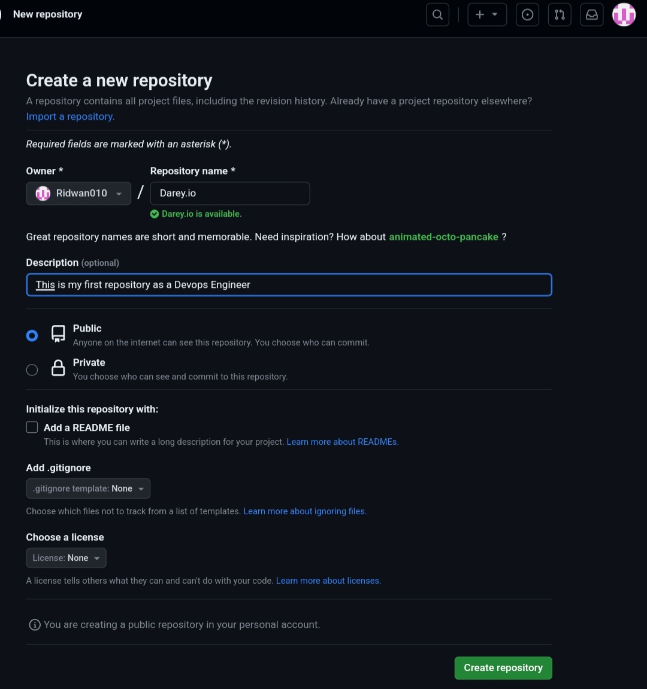

# Git

## Introduction To Git
Version control may be a basic angle of present day software development, empowering teams to collaborate efficiently, track changes, and keep up a verifiable record of their work. Git, a  common version control system, has ended up as the most popularly used within the software development industry. This project is about understanding and utilizing Git.

### What is Git ? 🤔
The simple definition is that git is a version control system. A version control system is a software tool that helps manage and track changes to files and directories in a project over time. It is an important tool for devops engineers. Git is an effective tool that helps developers run their source code effectively. It permits different people or teams to work on the same project  without clashes. 
This project aim to present the world of Git, covering everything from the essentials to more advanced points. You'll learn how to make repositories, commit changes, clone repositories, merge branches, create personal access token for commit made locally and collaborate successfully with others. 

### Importance of Git
The knowledege of git is needed by anyone into software development and deployment, ranging but no limited from developers to devops engineers, project managers, system administrator. Some of the benefit of using git are;

- Collaboration: Git allows teams to work collaboratively. In the devops lifecycle software development and deployment usually require teams to work together. For example, developers push code changes to a remote repository, QA engineer pull the code changes for testing and operations engineer deploy code changes into production using git.
- Version History: Git maintains a detailed history of changes, therefore, it makes it easy to track who made changes, what changes they made and when the changes were made.
- Branching and Merging: Git's branching and merging capabilities make it possible for development team to create other branches separate from the main codebase to work on new software version, features or fix bugs in previous release version before integraging them into the main codebase.
- Distributed Development: Git allows for distributed development, meaning team members can work on their copies of the code and merge changes later, even when not connected to the internet.
- Open Source Collaboration: Many open-source projects use Git, so understanding it is essential for contributing to or maintaining open-source software.

### Target Audience

This project is suitable for a wide range of professionals in different tech industry which are:

- Devops Engineers: Git is needed by devops engineers for tracking changes made to source code, collaborate on project, deploy code to production, manage infrastructure and resources
- Software Developers: Git is an esssential tool for the management of source code, and developers of all levels can benefit from mastering it.
- Project Managers: Understanding Git helps project managers track progress and coordinate team efforts efficiently.
- System Administrators: Git is not limited to code; it can be used to manage configurations, scripts, and documentation, making it valuable for system administrators.
- Data Scientists: Git is useful for managing data science projects and collaborating with colleagues on research.

### Prerequisites

Learners should have;
- Basic understanding of linux and its commands.
- A code editor or IDE of their choice
    - Emacs, vim or nano for linux users.
    - Visual Studio Code for Windows and Mac Users
- Access to Git installed on their system.
- A github account create [one](https://github.com)
  
No prior experience with Git is required.

### Git Goals:

By the end of this project, learners  would;
- Fully understand the basics of Git, including repositories, commits, and branches.
- Effciently use git commands like git init, git add, git commit, git remote, git push, git pull, git clone e.t.c.
- Collaborate effectively with others people or team using Git.
- Implement branching strategies to organize and manage code changes.

This project is designed to equip learners with the knowledge and skills needed to confidently use Git in  professional and personal projects, regardless of your role in the tech industry.

## Table of Contents
## Getting Started With Git

### What is Github

Github is a code repository where all code changes made locally are kept remotely. It is a tool for version control and increases collaboration among cross functions team.

### Creating a Github account
click [here](https://github.com) to create an account 

#### a. Installing Git
***i. Windows***
    
Download [git](https://gitforwindows.org/) installer for windows

***ii. For Linux***
Commands for installation of git depends on the linux distribution package manager

- For Ubuntu or Debian ditribution

       sudo apt update 
       sudo apt install git
The commands above will update package list and install git using apt with super user privileges.

- For Red Hat or CentOS distribution packages

        sudo yum update
        sudo yum install git
  The commands above will update package list and install git using yum with super user privileges.
  
***iii. For Mac***

 On mac operating systems, git can be install by using Homebrew
    Launch a terminal and run the below commands
    
     /bin/bash -c "$(curl -fsSL https://raw.githubusercontent.com/Homebrew/install/HEAD/install.sh)"
     brew install git 
The first command above will install homebrew and the later will installgit using brew.

Confirm installation of git by running the below command

       git --version 

#### b. Git commands

Before diving further into git, below are some basic git commands which would be used for implementation as we move on;

***git add:*** add files or folder that are to be commited to your repository to a staging area

***git  commit:*** record changes to the repository

***git push:*** update changes made in a local repository to remote repository

***git init:*** creates an empty git repository or initializes an exixting one

***git pull:*** fetch changes fo=rom a remote repository to a local branch

***git --version:*** checks the installed git version.

***git config --global user.name "Your Name":*** Set your global Git username.

***git config --global user.email "youremail@example.com":*** Set your global Git email.

To know  more detailed explanation of Git commands and their usage, run;

    git --help

#### c. Core concepts

***i. Repositories***

Git repos are where files are stored temporarily before they are pushed to a remote repository
 
    sudo mkdir darey_io
    cd darey_io
    echo "Welcome to darey.io" >> README.md
    git init
 The commands above;   
- Create a folder or directory in your local environment,
- move into the directory
- create a README.md file
- initializes the folder into a repository

***ii. Commits*** 

     git add README.md
     git config --global user.name "Your Name"
     git config --global user.email "youremail@example.com"
     git commit -m "This is my first commit as a devops engineer"
     
- Add the README.md file created in the previous step to a staging area
- Set your global Git username
- Set your global Git email and;
- Commit changes

  

***iii. Branches***

Git branches are ways to separte changes made to a repository from the master or main branch. There are primarily to types of branches on github which are the master and main branch. The main branche is the default branch on github and often the primary branch on github.
Listing available branch in your local repository 

    git branch 
    git checkout -b main

- List the available branches
- Create a main branch and switch to the branch. The "-b" allows to switch to main branch after it is created, otherwise, it would just create the branch without switching to it

  

  - To switch to anoher branch

        git checkout branch
    - Merging branches together
   Merging branches is very important in git. It allows to add changes made separately to the main codebase.

          git merge master

  The git command above merge the master branch while in the main branch
    
  - To delete a branch

        git branch -d <branch_name>
         git 
 In order to push changes to the remote repository on github, we need the http link of the remote location.

     git remote origin -v
 Add remote origin before pushing changes.

     git remote add origin https://github.com/Ridwan010/darey_io.git
 Push Changes to your github account 

     git push -u origin main
***Note: After pushing changes to github, a prompt will be brought up asking for your username and password to your github account in order to push changes.***

### Creating a personal access token (PAT)
Personal Access Token is a form of authentication that is used to access a Github account from the command line using Git. It give access to repository locally and server as a more secure way to access a github account by replacing the username and password.
With the help of a PAT, we can eliminate the prompt showing up after pushing saved changes 
to github. The steps below shows how to create a PAT

Click on the top right corner

Select settings from dropdown

Select Developer Settings

Select personal access token 

Select Token(classic)

Click on Generate new token to generate a new one

Your PAT should be stored safely and cannot be shared with anyone. Store somewhere you can only access it once after it is generated.
### Creating a repository on github 

### Clonning a repository from your local environment 
The format for clonning to a repository locally 

    Git clone <repository url>

Clonning to the repository created.

    git clone https://<PAT>@github.com/Ridwan010/Darey.io.git

### Committing and Pushing changes to your remote location (github)
Changes made in a github repository can be committed locally and then later pushed into a remote repository on github.
Create a non empty file in the cloned github repository.

    echo "## This is my first repository as a devops engineer" > Readme.md
Add Changes made 

    git add .

Commit Changes 

    git commit -m "This is my first commit"
Push Changes to remote github repository 

    git push

