### Implementing Wordpress Website With LVM Storage Management
# Implementing-Wordpress-Web-Solution


Three-tier Architecture
Generally, web, or mobile solutions are implemented based on what is called the Three-tier Architecture.

Three-tier Architecture is a client-server software architecture pattern that comprise of 3 separate layers.

Your 3-Tier Setup

* A Laptop or PC to serve as a client
* An EC2 Linux Server as a web server (This is where you will install WordPress)
* An EC2 Linux server as a database (DB) serve


1. **Create an AWS instance using RedHat Distribution**

The EC2 instance will serve as a Web Server, create 3 volumes in the same AZ as the Web Srver EC2, each of 10GB.


2. Attach the three volumes one by one to your Webserver EC2 instance

<table>
  <tr>
   <td></td>
    <td></td>
    <td></td>
  </tr>
</table>


3. Open up the Linux terminal to begin configuration

4. Use `lsblk` command to inspect what block devices are attached to the server. Notice names of your newly created devices. All devices in Linux reside in `/dev/` directory. Inspect it with ls /dev/ and make sure you see all 3 newly created block devices there – their names will likely be `xvdf`, `xvdh`, `xvdg.`


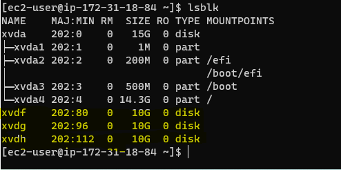

5. Use `df -h` command to see all mounts and free space on your server

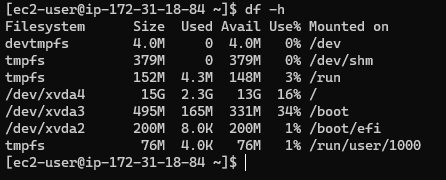

6. Use `gdisk` utility to create a single partition on each of the 3 disks

**`sudo gdisk /dev/xvdf`**

<table>
  <tr>
    <td></td>
    <td></td>
    <td></td>
  </tr>
</table>

7. Use `lsblk` utility to view the newly configured partition on each of the 3 disks.

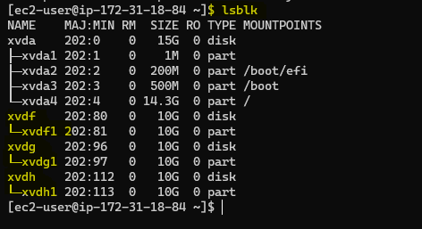


8. Install lvm2 package using `sudo yum install lvm2`. Run `sudo lvmdiskscan` command to check for available partitions.

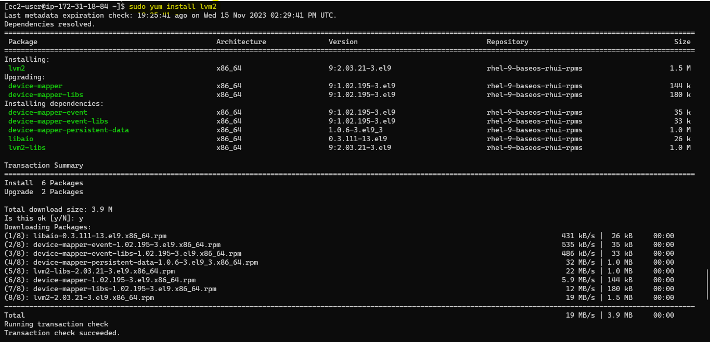


9. Use `pvcreate` utility to mark each of 3 disks as physical volumes (PVs) to be used by LVM.

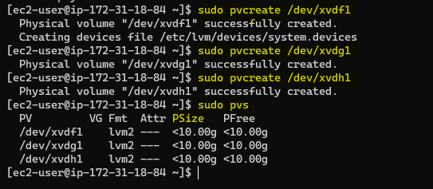


10. Use `vgcreate` utility to add all 3 PVs to a volume group (VG). Name the VG **webdata-vg**

**`sudo vgcreate webdata-vg /dev/xvdh1 /dev/xvdg1 /dev/xvdf1`**


11. verify that VG has been created 


12. Use `lvcreate` utility to create 2 logical volumes. **apps-lv (Use half of the PV size), and logs-lv Use the remaining space of the PV size**. NOTE: apps-lv will be used to store data for the Website while, logs-lv will be used to store data for logs.

```
sudo lvcreate -n apps-lv -L 14G webdata-vg
sudo lvcreate -n logs-lv -L 14G webdata-vg
```


13. Verify that your Logical Volume has been created successfully by running sudo lvs


14. Verify the entire setup

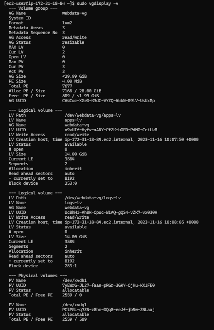

15. Use `mkfs.ext4` to format the logical volumes with `ext4` filesystem

```
sudo mkfs -t ext4 /dev/webdata-vg/apps-lv
sudo mkfs -t ext4 /dev/webdata-vg/logs-lv
```
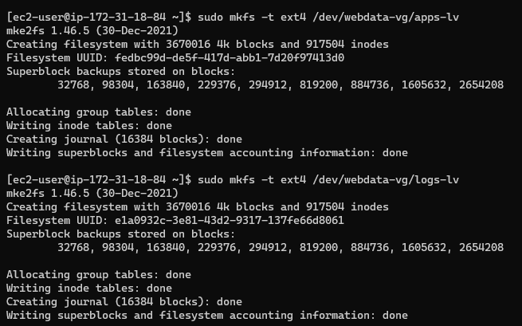

16. Create /var/www/html directory to store website files

**`sudo mkdir -p /var/www/html`**


17. Create /home/recovery/logs to store backup of log data


**`sudo mkdir -p /home/recovery/logs`**


18. Mount /var/www/html on apps-lv logical volume


**`sudo mount /dev/webdata-vg/apps-lv /var/www/html/`**


19. Use rsync utility to backup all the files in the log directory /var/log into /home/recovery/logs (This is required before mounting the file system)


**`sudo rsync -av /var/log/. /home/recovery/logs/`**


20. Mount /var/log on logs-lv logical volume. (Note that all the existing data on /var/log will be deleted. That is why step 15 above is very
important)


**`sudo mount /dev/webdata-vg/logs-lv /var/log`**


21. Restore log files back into /var/log directory


**`sudo rsync -av /home/recovery/logs/. /var/log`**


22. Update /etc/fstab file so that the mount configuration will persist after restart of the server.


**UPDATE THE `/ETC/FSTAB` FILE**


The UUID of the device will be used to update the /etc/fstab file;


**`sudo blkid`**


**`sudo nano /etc/fstab`**

Update /etc/fstab in this format using your own UUID and rememeber to remove the leading and ending quotes.


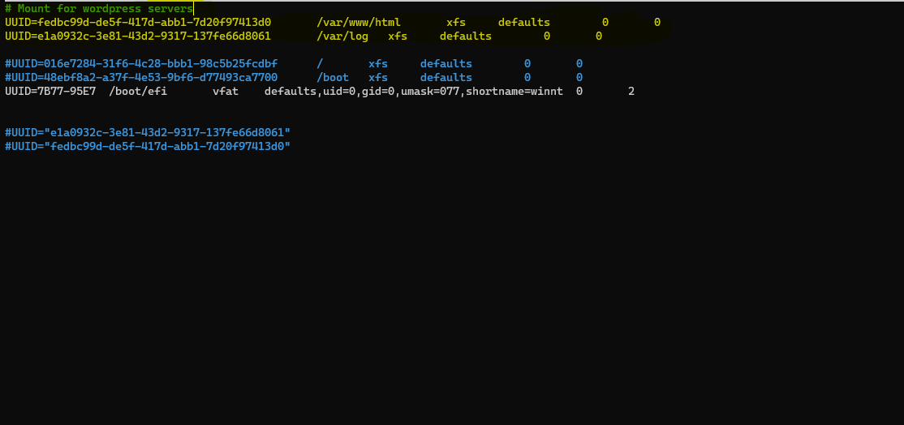


Test the configuration and reload the daemon

```
 sudo mount -a
 sudo systemctl daemon-reload
 ```

Verify your setup by running df -h, output must look like this:

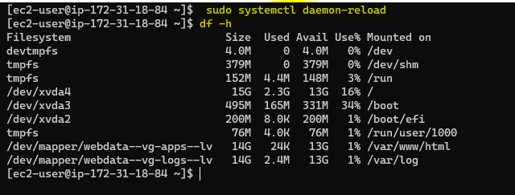


#### Prepare the Database Server


Launch a second RedHat EC2 instance that will have a role – ‘DB Server’
Repeat the same steps as for the Web Server, but instead of `apps-lv` create `db-lv` and mount it to `var/www/db` directory instead of `/var/www/html/`.

#### Install WordPress on your Web Server EC2

Update the repository

**`sudo yum -y update`**

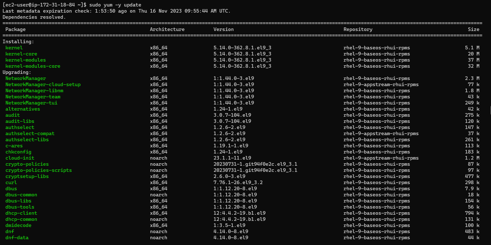

Install wget, Apache and it’s dependencies

`sudo yum -y install wget httpd php php-mysqlnd php-fpm php-json`

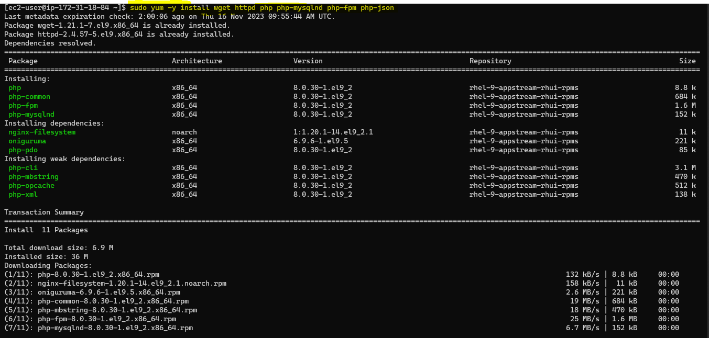

Start Apache

```
sudo systemctl enable httpd
sudo systemctl start httpd
```


To install PHP and it’s depemdencies

```
sudo yum install https://dl.fedoraproject.org/pub/epel/epel-release-latest-8.noarch.rpm
sudo yum install yum-utils http://rpms.remirepo.net/enterprise/remi-release-8.rpm
sudo yum module list php
sudo yum module reset php
sudo yum module enable php:remi-7.4
sudo yum install php php-opcache php-gd php-curl php-mysqlnd
sudo systemctl start php-fpm
sudo systemctl enable php-fpm
setsebool -P httpd_execmem 1
```


Restart Apache

**`sudo systemctl restart httpd`**


#### Download wordpress and copy wordpress to var/www/html
```
mkdir wordpress
cd   wordpress
sudo wget http://wordpress.org/latest.tar.gz
sudo tar xzvf latest.tar.gz
sudo rm -rf latest.tar.gz
cp wordpress/wp-config-sample.php wordpress/wp-config.php
cp -R wordpress /var/www/html/
```

#### Configure SELinux Policies

```
sudo chown -R apache:apache /var/www/html/wordpress
sudo chcon -t httpd_sys_rw_content_t /var/www/html/wordpress -R
sudo setsebool -P httpd_can_network_connect=1
```

#### Install MySQL on your DB Server EC2

```
sudo yum update
sudo yum install mysql-server -y
```
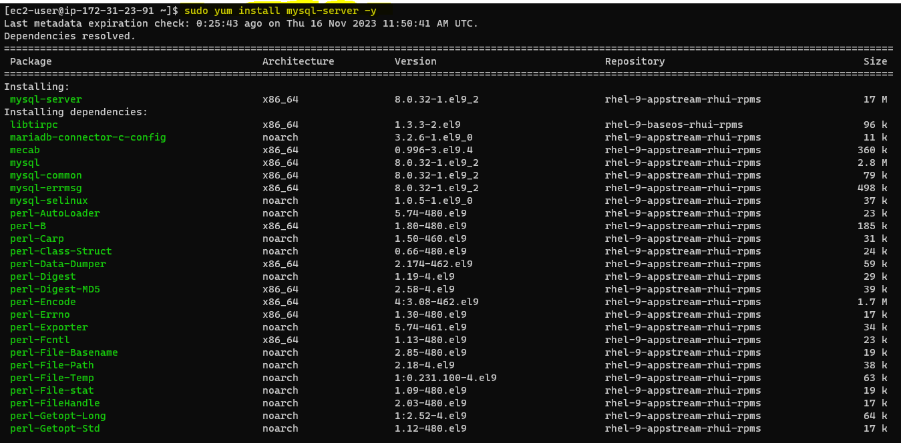

Verify that the service is up and running by using sudo systemctl status mysqld, if it is not running, restart the service and enable it so it will be running even after reboot:

```
sudo systemctl restart mysqld
sudo systemctl enable mysqld
```

#### Configure DB to work with WordPress

```
sudo mysql

CREATE DATABASE wordpress;

CREATE USER `myuser`@`<Web-Server-Private-IP-Address>` IDENTIFIED BY 'mypass';

GRANT ALL ON wordpress.* TO 'myuser'@'<Web-Server-Private-IP-Address>';

FLUSH PRIVILEGES;

SHOW DATABASES;

exit
```


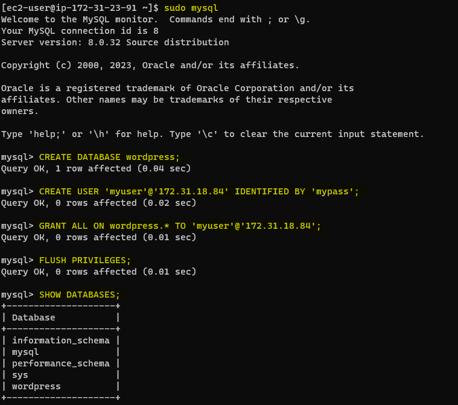

#### Configure WordPress to connect to remote database.

Edit inbound rule and open port 3306 on database server and allow connection from only our database server.

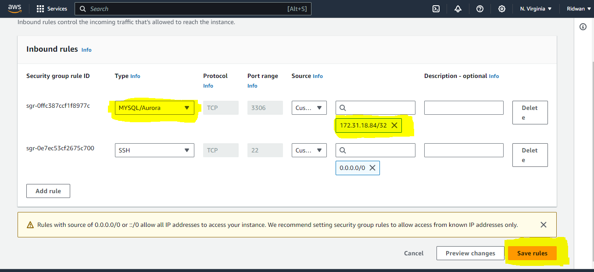


Install MySQL client and test that you can connect from your Web Server to your DB 
server by using mysql-client

```
sudo yum install mysql
sudo mysql -u admin -p -h <DB-Server-Private-IP-address>
```

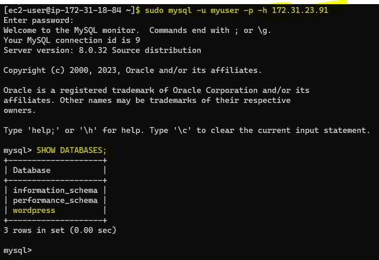

Verify if you can successfully execute SHOW DATABASES; command and see a list of existing databases.

Change permissions and configuration so Apache could use WordPress:

Enable TCP port 80 in Inbound Rules configuration for your Web Server EC2 (enable from everywhere 0.0.0.0/0 or from your workstation’s IP)

#### Verify Database Credentials
Check the wp-config.php file in your WordPress installation directory to ensure that the database credentials are correct.

    sudo nano /var/www/html/wordpress/wp-config.php
Verify the values below

    define('DB_NAME', 'wordpress');
    define('DB_USER', 'myuser');
    define('DB_PASSWORD', 'mypass');
    define('DB_HOST', 'database_private_ipaddress');


Try to access from your browser the link to your WordPress `http://<Web-Server-Public-IP-Address>/wordpress/`

<table>
  <tr>
   <td></td>
    <td></td>
  </tr>
</table>


<table>
  <tr>
   <td></td>
    <td></td>
  </tr>
</table>


