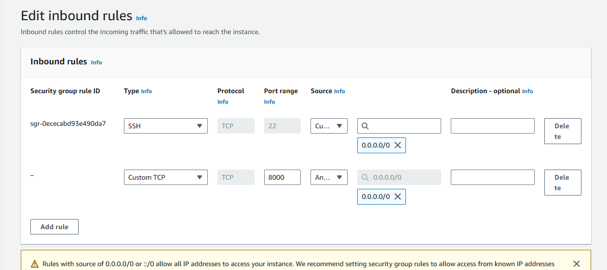
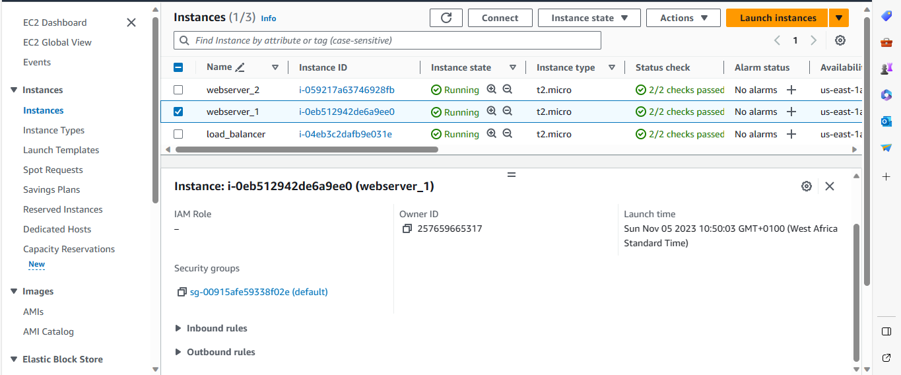
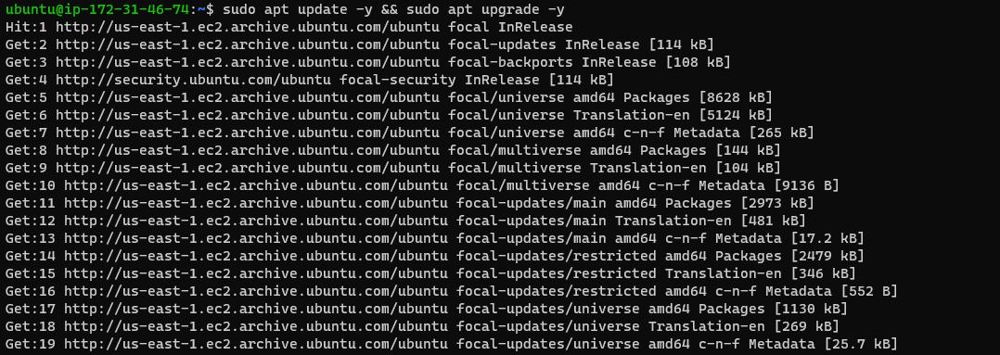
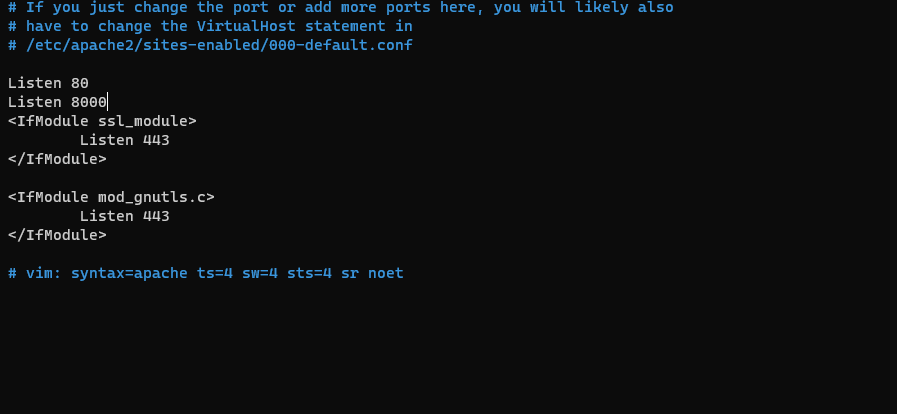
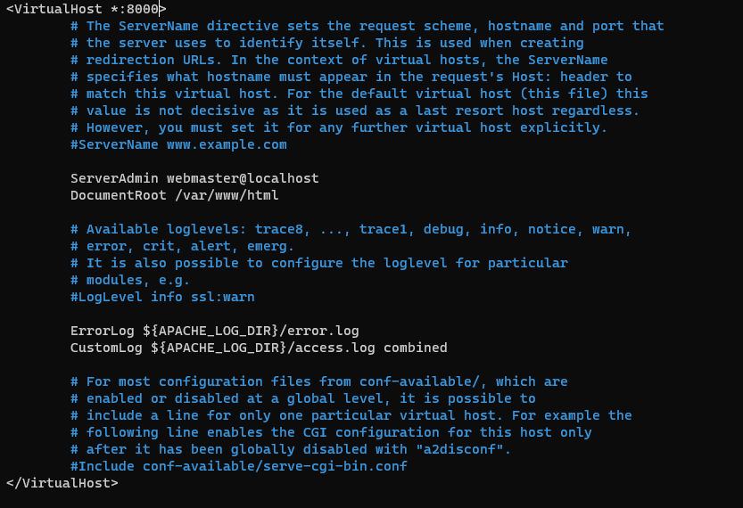

# Implememting Load Balancers With Nginx

# Introduction
In some of our previous projects, we have worked with nginx. Nginx is a web serveer capable of load balancing and reverse proxy. In this project we will dive deeper into the usage of nginx for load balaning.

#### Concept of Load Balancing
Have you ever wondered how big tech companies like facebook, netflix and amazon always have their services available to their high number of users. That is because they have load balancers that distribute traffic aross multiple servers
Load balancing is the process of distributing a set of tasks over a set of resources, thereby making the overall process of those tasks more efficient.

In this project, we will use nginx to distribute traffic across 2 different servers.

The image above show multiple client making request to a load balancer. The load balancer, make a request to a web server and gets a response then give the response back to the client. If the web server not available due to certain reasons which can either be that the server is down or cannot or cannot handle more requests, the load balancer will direct the client response to another server and give response back to the client.

#### Importance of a Load Balancer
From what we understand about the concept of load balancing, A load balancer is very important in modern IT and web services because it helps make sure applications work well and are always available. It does this by spreading network traffic across several servers. By making sure that no server gets too busy, it makes sure that everything works well and is reliable, fast, and can handle problems. This means that web application and web sites will still work and be fast even if lots of people are using them or if a server stops working. This helps make things better for users and makes online services stronger for industries like e-commerce, content delivery, and cloud computing.

#### Target Audience

DevOps Engineers: People who automate the management of servers and help applications run smoothly and efficiently, even when there are problems.

System administrators are people who want to improve the availability and speed of websites, especially when there are a lot of visitors or when the website is really important.

Web Developers: People who create and improve websites want to make sure that the websites work well and consistently, especially when there are changes in the number of people visiting the website.

Network administrators are in charge of setting up and looking after the network infrastructure and services.

#### Project Prerequisites
- An AWS account
- Knowledge of Linux
- Basic understanding of Web Servers such as apache and nginx
- Familiarity with linux text editors such as vim, emacs and nano

#### Project Goals
- Gain a clear understanding of load balancing and its importance in modern web application and server management.
- Learn how to configure and use Nginx as a load balancer, exploring its key features and capabilities.
- Discover how load balancing with Nginx can enhance the performance, reliability, and availability of web applications and services.
- Learn how to set up Nginx to ensure high availability by distributing incoming traffic across multiple backend servers and automatically handling server failures.

# Project Hghlight
- Implementing Load Balancers With Nginx

- Introduction
  - Concept of Load Balancing
  - Importance of Load Balancing
  - Target Audience
  - Project Prerequisites

- Implementation Of Load Balancer with Nginx
  - Provisioning EC2 Instances
  - Open New Security Group For Both webserver and Load Balancer
  - Install Apache Webserver
  - 1Configure Apache On Port 8000
  - Configure Apache To 1Serve Names of Both Webserver
  - Install and Configure Nginx As A Load Balancer For Both Webservers

- Real Life Scenarion of Load Balancing With Apache

- Conclusion

# Implementation of Load Balancers With Nginx
#### Step 1: Provisioning EC2 Instances

We will provision 3 EC2 instance, two will of these will be our webserver and one will be a load balaner

i. Launch 2 EC2 instances and name each "webserver_1" and "webserver_2"

ii. Launch another EC2 instance and name it "load balancer"

#### Step 2: Open New Security Group For Both Webservers and load balancer

i. For the webservers and load balancer, go to the security groups

ii Edit inbound rules on open port 8000 for our both webserver_1 and webserver_2 and port 80 for our load balancer

iii. Allow traffic from anywhere on the open ports

#### Step 3: Install Apache Webserver

i. Open 2 termianls and ssh into webserver_1 and webserver_2

  ***For windows, open command prompt or git bash and ssh into the webservers***

ii. Update and upgrade package lists 

    sudo apt update -y && sudo apt upgrade -y

iii. Install Apache 

    sudo apt install apache2 -y
  
iv. Confirm Apache has been successfully installed

    sudo systemctl status apache2

#### Step 4: Configure Apache to Port 8000

By default, apache listen on port 80. Since our load balancer will also be listening on port 80, we  need to make our webservers listen on port 8000

i. Grant users permission to read, write and execute the file ports.conf file

    sudo chmod u +rwx ports.conf
ii. Edit port.conf file 

    sudo nano /etc/apache2/ports.conf
iii. Add a new listen directive

iv. Add a new virtualhost statement since a new listen directive has been added

    sudo nano /etc/apache2/sites-available/000-default.conf

v. Reload Apache

    sudo systemctl reload apache2

** Note this step should be done for both webservers

#### Step 5: Configure Apache to Show Names Of Both Webservers

In the previous step, we set up a new listen directive and virtualhost statement. In our "000-default.conf", the document root is located at /var/www/html. We need to change the content of the file in our document root to show the name of our webserver. 

i. Edit index.html in /var/www/html

    sudo nano /var/www/html/index.html
ii. Delete the content in the file and paste the content below

      <!DOCTYPE html>
        <html>
        <head>
            <title>Apache EC2 Instance</title>
        </head>
        <body>
            <h1>Load Balancer</h1>
            
Webserver 1 & 2

        </body>
        </html>

iii. Save and close the file

iv. Restart Apache

    sudo systemctl restart apache2
***Note:*** This step should be done for both webserver1 and webserver 2

#### Step 6: Install and Configure Nginx As A Load Balancer For Both WebServers 

In the step, we will configure nginx as a load balancer for webserver 1 and 2

On our load balancer instance;

i. Update package lists and instal nginx

    sudo apt update -y && sudo apt install nginx -y

ii. Verify that Nginx is successfully installed 

    sudo systemctl status nginx

iii. Edit Nginx load balancer configuration file

    sudo nano /etc/nginx/conf.d/loadbalancer.conf

iv. Paste the configuration file below to configure nginx to act like a load balancer. A screenshot of an example config file is shown below: Make sure you edit the file and provide necessary information like your server IP address etc.

        
        upstream backend_servers {

            # your are to replace the public IP and Port to that of your webservers
            server 127.0.0.1:8000; # public IP and port for webserser 1
            server 127.0.0.1:8000; # public IP and port for webserver 2

        }

        server {
            listen 80;
            server_name <your load balancer's public IP addres>; # provide your load balancers public IP address

            location / {
                proxy_pass http://backend_servers;
                proxy_set_header Host $host;
                proxy_set_header X-Real-IP $remote_addr;
                proxy_set_header X-Forwarded-For $proxy_add_x_forwarded_for;
            }
        }
    
upstream backend_servers defines a group of backend servers. The server lines inside the upstream block list the addresses and ports of your backend servers. proxy_pass inside the location block sets up the load balancing, passing the requests to the backend servers. The proxy_set_header lines pass necessary headers to the backend servers to correctly handle the requests

v. Test if nginx configuration is correct

    sudo nginx -t

vi Restart nginx

    sudo systemctl restart nginx

vii. Paste load balancer public Ip address on your web browser to see the content of web server 1 and 2

# Real Life Scenarios With Load Balancing

- Managing the distribution of workload for a very busy online shopping website.
Imagine you have a very popular online store that gets a lot of visitors, especially when there are sales happening. Load balancing with Nginx means that when people visit a website, their requests are spread out evenly across many different servers that work together. This stops one server from getting overwhelmed, which makes everything work better and leads to a better shopping experience for your customers. In this situation, you can set up Nginx to distribute the workload evenly using different methods like rotating through each server, selecting the server with the least connections, or assigning specific servers based on the IP address. This ensures that resources are used efficiently.

- Ensuring that a Content Delivery Network (CDN) is always available.
Imagine you are in charge of overseeing a Content Delivery Network (CDN) that delivers multimedia content like videos and images to people everywhere in the world. Nginx's load balancing feature helps spread out content requests among many servers located in different places. Nginx's health checks can find problems with servers and redirect visitors to servers that are working properly. This helps make sure that content can still be accessed when a server isn't working. This example shows how Nginx helps make sure a distributed system can stay operational and handle errors well.

- Scalability for a Microservices Architecture: The ability to handle increasing amounts of work or traffic in a microservices architecture.
In a modern application setup with microservices, you have many separate services running on different servers. Load balancing is important for evenly spreading incoming requests among these small services. Nginx can be like a traffic controller for an API, directing client requests to the correct microservices according to certain rules and traffic patterns. This example shows how Nginx can make a microservices-based system more scalable, manageable, and reliable.

# Conclusion 

Using Nginx for load balancing can greatly improve the speed, dependability, and accessibility of web apps and services. By spreading out the number of visitors across many servers, Nginx makes sure that one server does not get too overwhelmed, resulting in a smoother experience for users and less chances of the website going offline. If you run a busy online store, a global content delivery network, or a small application, Nginx's load balancing abilities are important for optimizing your system.

As you keep looking, you will see that Nginx has many different ways to set it up, such as choosing how to share the work, checking if everything is running smoothly, and controlling how traffic moves around. By learning how to use these features, you can develop strong and efficient systems that can handle the needs of today's digital world. So, keep going on your journey, try out Nginx, and use what you know to solve real problems with balancing loads and improving web servers.
