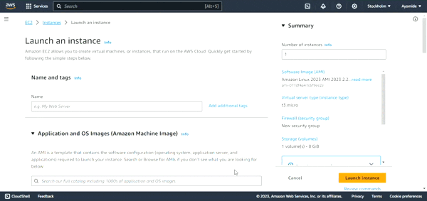

# Web Stack Implementation Using AWS

## Introduction

In the constantly changing world of software development, picking the right technology stack is crucial for the success or failure of a project. The "Web Stack" project is a program for people who want to learn how to make and launch web applications. This course teaches you how to create a type of web stack that works on all operating systems and allow users to interact with them. You will learn how to setup different web development tools and frameworks can work together effectively and also how to  deploy simple and e-commerce websites using these technology stacks to build these websites.

This project focuses on how to create a LAMP stack and deploy static pages onto the stack. We will begin by looking at the main parts and structure of this new web system. Through this, learners will learn about the benefits and possibilities of using these different software technologies together.


### What is Web Stack ?
A simple meaning of web in any interconnected things. A stack on the other hand is a collection of similar things or objects which are together.
A web stack, often referred to as a technology stack or simply a "stack," is a collection of software technologies and tools that work together to enable the development and deployment of web applications. It includes various layers, each serving a specific purpose in the web development process. The primary components of a web stack typically includes the operating system, web server, database, and programming language/framework.

### Components of a Web Stack
**Operating System (OS)**: This is the foundational layer of the stack and represents the underlying software that manages hardware resources. Common choices include Linux, Windows, or macOS.

**Web Server**: The web server handles HTTP requests from clients (usually web browsers) and serves web pages in response. Popular web servers include Apache, Nginx, and Microsoft Internet Information Services (IIS).

**Database**: The database layer manages and stores the application's data. There are two main types of databases: relational databases (e.g., MySQL, PostgreSQL) and NoSQL databases (e.g., MongoDB, CouchDB). The choice depends on the specific requirements of the application.

**Programming Language/Framework**: This layer involves the programming language and/or framework used to build the web application. Examples include PHP, Python, Ruby, JavaScript (Node.js), and frameworks like Django, Ruby on Rails, Flask, Express.js, etc.

**Additional Components**: Depending on the complexity of the application, additional components might be included, such as caching mechanisms (e.g., Redis), load balancers, and front-end libraries or frameworks (e.g., React.js, Angular, Vue.js).

### Importance Of Web Stack
**Compatibility and Integration**: A well-constructed web stack ensures that all components work seamlessly together, promoting compatibility and integration throughout the development and deployment process.

**Scalability**: The choice of technologies in a web stack can impact how easily an application can scale. A scalable web stack allows for the efficient handling of increased user loads.

**Development Efficiency**: Developers often specialize in specific stacks based on their expertise and project requirements. A consistent and well-understood stack can lead to increased development efficiency.

**Maintenance and Troubleshooting**: A standardized stack simplifies maintenance and troubleshooting. Developers and operations teams are familiar with the technologies involved, making it easier to identify and resolve issues.

**Community Support**: Popular stacks often have large and active communities, providing valuable resources, documentation, and support. This can be crucial for developers seeking assistance or solutions to common problems.
Understanding the concept of a web stack is fundamental for anyone involved in web development, including software engineers, web developers, and DevOps professionals. It serves as the foundation for building robust and scalable web applications. The choice of a specific stack depends on factors such as project requirements, team expertise, and the overall goals of the application.


There are different types of web stack and they all perform different function. There are different types of web stacks which are;

**LAMP Stack**
- Components: Linux (Operating System), Apache (Web Server), MySQL (Database), PHP (Programming Language).
- Importance: LAMP has been a traditional and widely-used stack for building dynamic web applications. It provides a robust, open-source solution for hosting and serving web content.

**LEMP Stack**
- Components: Linux, Nginx (Web Server), MySQL, PHP.
- Importance: Similar to LAMP, LEMP replaces Apache with Nginx as the web server. Nginx is known for its high performance and scalability, making LEMP a suitable choice for high-traffic websites.

**MEAN Stack**
- Components: MongoDB (Database), Express.js (Web Application Framework), Angular (Frontend Framework), Node.js (JavaScript Runtime).
-  Importance: MEAN is a full-stack JavaScript framework, allowing developers to use a single language (JavaScript) throughout the entire application. It's known for its flexibility and efficiency in building modern and scalable web applications.

**MERN Stack**
- Components: MongoDB, Express.js, React (Frontend Library), Node.js.
- Importance: Similar to MEAN, MERN also uses JavaScript for both frontend and backend development. React is used on the frontend, providing a component-based architecture for building user interfaces.

These stacks all have diferent function. In this project, we will be focusing on LAMP Stack

### **LAMP Stack**

The word LAMP refers to a group of open source software installed together which can be used to host web applications. The stack consists of four software technologies which are linux, a database, an hypertext processor and a web sever that is not capable of load balancing and reverse proxy
***LAMP*** meaning Linux; a unix operating system, Apache; a web server, Mysql; a database and PHP; an Hypertext preprocessor.

### Importance of Using LAMP Stack

- LAMP is a popular and flexible web development platform that supports many websites and web applications. If you understand LAMP, you can create web solutions that are interactive, have many features, and can handle a lot of traffic.
- All parts of the LAMP stack are free for anyone to use and contribute to, which encourages people to work together in building websites and web applications. This not only saves money but also promotes working together and coming up with new ideas.
- LAMP is used by many different industries. It is important for web developers, system administrators, and IT professionals to know about it.
- LAMP includes both the skills needed for the part of a website that users see (HTML, PHP) and the skills needed for the behind-the-scenes part of a website (Linux, Apache, MySQL). LAMP provides a complete view of web development.
- Entrepreneurs who want to start their own web-based businesses or digital projects without relying too much on specialized technologies find LAMP skills very useful.

### Target Audience

This project is for devops engineers who wants to become proficient in software deployment, particularly those seeking to deploy dynamic web applications but are not limited to;
- System administrator
- Site Reliability Engineers


### Prerequisite
- An AWS account. [Click here](https://portal.aws.amazon.com/billing/signup#/start/email) to create a free account
- Access to a terminal or a virtual machine
- Knowledge of linux
- SSH [Click here](https://www.digitalocean.com/community/tutorials/how-to-set-up-ssh-keys-on-ubuntu-20-04) to kearn more on ssh keys

### Goals
By the end of this project, learners should be able to setup a LAMP Stack and deploy a static php page.

# Project Highlight

- Web Stack Implementation (LAMP Stack) In AWS

- Introduction To Web Stack
  - What is Web Stack
    - Lamp Stack
      
  - Importance of Using LAMP Stack
  - Target Audience
  - Prerequisite
  - Goals To Be Accomplished By The End of The Project

- Getting Started With LAMP Stack
  - Launching an Ubuntu Instance on AWS Console and SSH Into It From Your Terminal
  - Installating Apache
  - Installating  Mysql
  - Installating PHP
  - Configuring Apache Web server to Serves As A Virtual Host
  - Modifying Directory Index To Serve php files
  - Testing PHP with Apache
  - Testing PHP and Mysql with Apache (LAMP Stack)

- Best Practices Of LAMP Stack

-  Real Life Scenarios With LAMP STACK

- Conclusion

## Creating A LAMP Stack

#### Step 1: Launch an Ubuntu Instance on AWS Console and SSH Into From Your Terminal

**i. Sign in to your AWS account**

**ii. On the top right select services and search for ***Elastic Cloud Compute (EC2).*****

**iii. From the menu on the left side, select ***instances.*****

**iv. Select ***launch instance*** on the top right side.**

 **v. Follow the image below to finish lauching an instance.**



**Important**: Be sure to launch an Ubuntu 20.04LTS instance. Also keep your .pem key safely. Once it is lost, you will not be able to ssh into the instance again. Also, anyone with the key can have access to your instance

**SSH into your ubuntu instance**

SSH is an encrypted protocol used to administer and communicate with servers. An SSH key is used to access a remote server through an SSH connection. 
Remember we created a `lamp.pem` key while creating our instance, now we will use this key to connect to our instance.

- For windows operating system, open command promot or powershell and paste the code below. 

      ssh -i path/to/lamp.pem ubuntu@public_ip_address

- For mac and linux operating system, open a terminal and paste the code below

      ssh -i path/to/lamp.pem ubuntu@public_ip_address

[SSH](Images/lamp/instance-connect)

***Make sure you specifythe actual path to your lamp.pem key that was download when creating the instance and public_ip_address should be replaced the actual ubuntu instance public ip address***


#### Step 2: Installating Apache
In the previous step, we were able to create and instance and ssh into the instance with our key, now let's install apache webserver. Follow the steps below for successful installation

update package lists and apt repositories

    sudo apt update -y
Install apache web server

    sudo apt install apache2 -y
Allow firewall for apache

    sudo ufw allow in "Apache"
NOTE: The step above will allow firewall for apache once it is enabled, it is important we allow firewall for ssh. ssh runs on port 22, if firewall is not allowed for ssh running on port 22, connection to the ubuntu instance via ssh will be permanently denied

    sudo ufw allow 22
    
To check if apache web server has been installed successfully

    sudo systemctl status apache2


By default, apache runs on port 80, so we need to allow incoming traffic on that port. We need to open security group and edit inbound rules in order to do that.


To access your web server on your browser

    http://ubuntu_instance_public_ip_address


The Apache default page above will displayed. 
You can check your ubuntu instance ip address from your aws console from the EC2 instance service management or input the command below

    curl http://icanhazip.com

#### Step 3: Installating Mysql

In the previous, we were able to install apache web server successfully. In this step, mysql will be installed as a database to store data for our web application.
apt repositories has been updated in the previous step, mysql should be installed directly

    sudo apt install mysql-server


Check if mysql has been successfully installed

    sudo systemctl status mysql 


Let's log in to mysql server as the root user

    sudo mysql

We have been able to log into mysql server successfully, but our database is not yet secure, we need to run mysql security installation script, but before that we need to create a password for the root user, if not the root user might be unable to login to mysql after runnig the script.

Still logged in as the root user, let,s create a password

    ALTER USER 'root'@'localhost' IDENTIFIED WITH mysql_native_password BY 'MypassKey1.'

You can now exit mysql prompt

    mysql>exit
    
Now let's secure mysql installation 

    sudo mysql_secure_installation

Running the installation script above, will ask for a password validation from the root user. We need to validate it using the password we created inside mysql prompt earlier
```
Securing the MySQL server deployment.

Enter password for user root:
```
This will then ask you to validate password component. When MySQL prompts you to validate a password component, this component checks the strength of passwords and enforces a password policy. 
Choosing "No" allows you to set up a password policy that aligns with your organization's security requirements. It may involve configuring the password complexity rules, length, expiration policies, and other parameters according to your specific needs.It is recommended to select any other key for no
```
VALIDATE PASSWORD COMPONENT can be used to test passwords
and improve security. It checks the strength of password
and allows the users to set only those passwords which are
secure enough. Would you like to setup VALIDATE PASSWORD component?

Press y|Y for Yes, any other key for No:
```
Follow the image below for other optional steps


Log into mysql as the root user

    sudo mysql -u root -p
The `-u` flag tells mysql which user is trying to login to the server and the `-p` flag show a prompt for passowrd on executing the command.
Log out of mysql

    mysql>exit


#### Step 4: Installing PHP

So far, we have been created an EC2 instance, installed Apache and Mysql. The last software of the LAMP stack is PHP will be installed in this step.

    sudo apt install php libapache2-mod-php php-mysql
Check for the successful installation of php

    php -v


#### Step 5: Configuring Apache Web Server To Serve As A Virtual Host 
We want to deploy a static page on our stack, therefore configuring apache to serve as a virtual host is mandator. We need to create a  directory for our codes to be hosted at the location `/var/www/html/darey.io`, "darey.io" can be named any name. The directory will contain the php codes which apache will serve. The codes are not limited to php codes but also html, css, javascript e.t.c. . Apache web server is smart enough to know this location and serve it with the help of its configuration file.

    sudo mkdir /var/www/html/darey.io
Create an simple html file which our apache will serve

    sudo nano /var/www/html/darey.io/index.html
It should have the content below


    <h1>Welcome to Darey.io, Apache works</h1>
darey.io is the directory created which will contain our php code
Assign ownership of the directory with the user

    sudo chown -R $USER:$USER /var/www/html/darey.io

Create a new configuration file that will replace apache default configuration file at /etc/apache2/sites-available

    sudo nano /etc/apache2/sites-available/darey_io.conf

Paste the code snippet below in darey_io.conf

    <VirtualHost *:80>
          ServerName localhost
          ServerAlias localhost
          ServerAdmin webmaster@localhost
          DocumentRoot /var/www/html/darey.io
          ErrorLog ${APACHE_LOG_DIR}/error.log
          CustomLog ${APACHE_LOG_DIR}/access.log combined
    </VirtualHost>

Enable the new .conf and disabled default.conf file

    sudo a2ensite /etc/apache2/sites-available/darey_io.conf

    sudo a2dissite /etc/apache2/sites-available/000-default.conf
Reload apache conf. file to make sure the file has no errors

    sudo apache2ctl configtest

Reload apache 

    sudo systemctl reload apache2

Check your web browser.

    http://ubuntu_instance_public_ip_address


#### Step 6: Modifying Directory Index To Serve php files

By default, in the index.html comes before index.php file in `/etc/apache2/mods-enabled/dir.conf`. As a result of this, apache will always serve html files before php file. The directory index needs to be modified to apache read php files


    sudo nano /etc/apache2/mods-enabled/dir.conf
Change the arrangement of index.html and index.php. index.php should be first on the list of directory index

    <IfModule mod_dir.c>
        DirectoryIndex index.php index.html index.cgi index.pl index.xhtml index.htm
    </IfModule>


Save and close the file then reload apache

    sudo systemctl reload apache2

#### Step 7: Testing PHP with Apache 

Replace the index.html file in /var/www/html/darey.io with index.php with a simple php info.
```
    sudo rm /var/www/html/darey.io/index.php
    sudo nano /var/www/html/darey.io/index.php
```
Paste the contents below

    <?php
    phpinfo();
Save and close the file 

You can use ubuntu instance public ip address to access the php file served by apache from your web browser 


The default page above will be displayed.

#### Step 8: Testing PHP and Mysql with Apache (LAMP Stack)

In the previous step, php was tested with apache by using apache to serve a default php page. Let's do ma
The first to do is to create a database with datas

Log into mysql as root user 

    sudo mysql 

***In the mysql shell***
Create a database called darey_io

    CREATE DATABASE darey_io;

Create a new user called ***darey*** with password ***A different username or password can be used***

    CREATE USER 'darey'@'%' IDENTIFIED WITH mysql_native_password BY 'Ab123456789';
Grant 'darey' all permissions 

    GRANT ALL ON root.* TO 'darey'@'%';
Log out of mysql

    exit
Log in to mysql as user 'darey'

    mysql -u darey -p Aa123456789

Checkout the database created as the root user

    SHOW DATABASES;
The output below will be printed

    +--------------------+
    | Database           |
    +--------------------+
    | darey_io           |
    | information_schema |
    +--------------------+
    2 rows in set (0.000 sec)
Create a table called devops_list in the database created 

    CREATE TABLE darey_io.devops_list (
	item_id INT AUTO_INCREMENT,
	content VARCHAR(255),
	PRIMARY KEY(item_id)
    );
Add a few lines to the list

    INSERT INTO darey_io.devops_list (content) VALUES ("Linux needed for devops");
    INSERT INTO darey_io.devops_list (content) VALUES ("Git needed for devops");
    INSERT INTO darey_io.devops_list (content) VALUES ("LAMP needed for devops");

Check that the lines have been successfully inputed

    SELECT * FROM darey_io.devops_list;
To output below will be shown 

    +---------+--------------------------+
    | item_id | content                  |
    +---------+--------------------------+
    |       1 | Linux needed for devops  |
    |       2 | Git needed for devops    |
    |       3 | LAMP needed for devops   |
    +---------+--------------------------+
    3 rows in set (0.000 sec)
Exit mysql shell.

In the /var/www/html we need to edit our index.php file

    sudo nano /var/www/html/index.php
Paste the content below 

    <?php
    $user = "darey";
    $password = "Ab123456789";
    $database = "darey_io";
    $table = "devops_list";
    
    try {
    $db = new PDO("mysql:host=localhost;dbname=$database", $user, $password);
    echo "<h2>Devops</h2><ol>"; 
    foreach($db->query("SELECT content FROM $table") as $row) {
    echo "<li>" . $row['content'] . "</li>";
    }
    echo "</ol>";
    } catch (PDOException $e) {
    print "Error!: " . $e->getMessage() . "<br/>";
    die();
    }
Save and close the file
Check you web browser with your ubuntu instance ip address to see apache serving php with the contents in the database displayed.

## Task For This Project
i. Launch an ubuntu instance and ssh into it.
ii. Set up a lamp stack
iii. Download a simple bootstrap code to host on your Stack. Use <wget https://github.com/startbootstrap/startbootstrap-agency/archive/gh-pages.zip>
iv. unzip the folder host it on your LAMP Stack 

***Hint:*** unzip the folder with the command "unzip" if not installed, installed unzip with 

	sudo apt install unzip
 Then move the whole folder you unziped to your project folder and update the server block configuration file.

# Best Practices of LAMP Stack

In the world of LAMP Stack development, it is important to follow the best practices used by professionals in order to build strong, safe, and easily manageable web applications.

- Making use version control like git to track of changes in your code, work with others, and make sure your project is saved as a backup.

- Monitoring and logging: This should be done to monitor your software stack. It will help you find and fix problems in your stack or instance before they cause any trouble.

- Regular backups meaning making copies of your web application and its database on a regular basis. This is done to protect against losing important data or if there are problems with the server.

# Real life Scenarios With LAMP Stack

**Blogging Platform**

Imagine you're tasked with building a blogging platform similar to WordPress. In this use case, you'll utilize the LAMP stack to develop a user-friendly content management system, enabling users to create, edit, and publish blog posts. You'll also need to implement user authentication and access control to ensure content security.

**E-commerce Website**

Suppose you're working on an e-commerce project where you need to create a robust online store. In this scenario, you can employ the LAMP stack to build the website's front-end for product listings, user registration and authentication, shopping cart functionality, and secure payment processing.

**Data-Driven Dashboard**

Consider a scenario where you're tasked with developing a data-driven dashboard for a business analytics platform. You can use the LAMP stack to build the back-end that connects to various data sources, processes data, and serves it to the front-end for visualization and analysis.


# Conclusion

  To sum up, the LAMP Stack project helps you learn and gain skills to become a skilled web developer who can create interactive web applications. If you follow the best ways of doing things in the industry, make your database work efficiently, keep it safe, and use a flexible design, you can create web applications that work well and are also strong and safe.

When you learn about LAMP Stack development, make sure to keep learning and staying updated with new technologies and trends. The LAMP stack is only the start of your journey in creating websites. If you are working on your own project or with a team, your new skills will help you make web applications that have a big influence on the internet.


