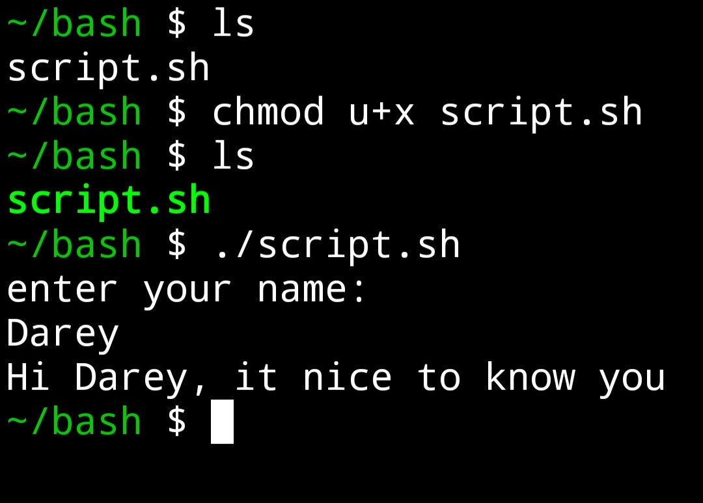
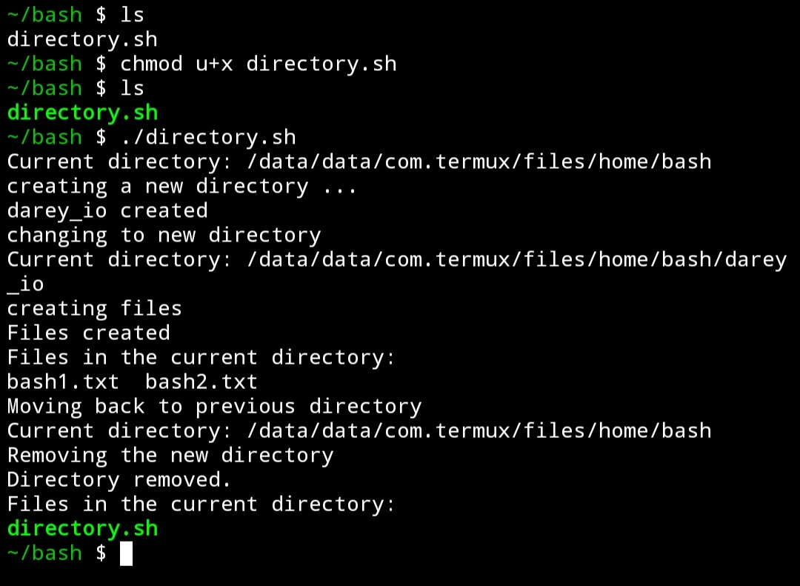
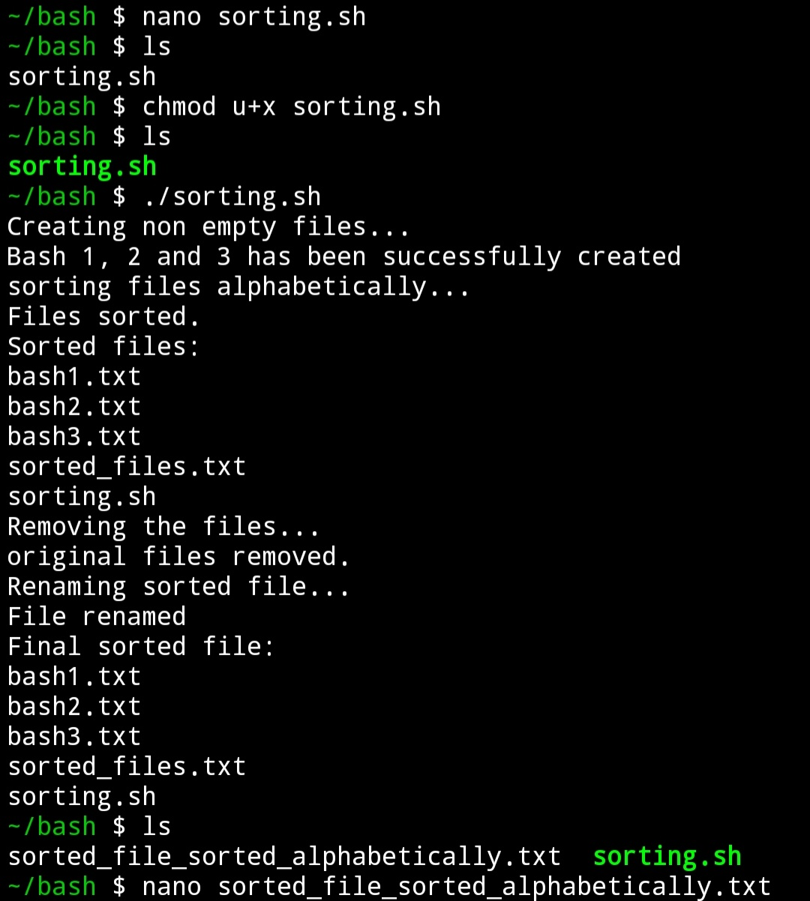

# Shell Scripting 

# Introdution To Shell Scripting

Think about you working for a big orginisation. In this organisation, you are tasked with deploying a software everyday on nginx or backing up files and storing them in a remote location. In order to make the task easier, we can use a script.
In a simple explanation, a script is any set of instructions that eliminates manual reptitive task and automates it. There are different types of scripting languages but there are three major scripting langauges in the world of devops which are 
- Shell script
- Python script
- Javascript

### What Is Shell Scripting
Shell scripting is the process of writing and executing a series of commands in a shell, which is a command-line interface to an operating system. A shell script is essentially a script or program written in a shell language, such as Bash, sh, zsh, or PowerShell ?

### What Is a Shebang or Hashbang (#!/bin/bash)
At the beginning of a script, is a ***shebang or hashbang***. It is a special notation used in Unix-like operating systems, to specify the interpreter that should be used to execute the script. In this case, #!/bin/bash specifically indicates that the Bash shell should be used to interpret and execute the script.

 The #! (pronounced as "shebang" or "hashbang"): This character sequence tells the operating system that what follows is the path to the interpreter that should be used to execute the script.

/bin/bash: This is the absolute path to the Bash shell executable. It tells the system to use the Bash interpreter located at /bin/bash to run the script.

When a script with a shebang line like #!/bin/bash, the operating system looks for the specified interpreter (in this case, Bash) and uses it to execute the script. 

Without a shebang line, the system may not know how to interpret and execute the script, and you may need to explicitly specify the interpreter when running the script. 

### Syntax For a Shell script
Every line of a bash file starts with a shebang 
   
    #!/bin/bash
Execute a bash script assuming the file containing the script is darey

    ./darey.sh
Note: all bash file are always ending with an extension .sh
Also, darey.sh must be an executable file before it can be executed

    sudo chmod u+x darey.sh
 The command above make darey.sh an executable file

 An alternative for executing a bash script

    bash darey.sh 

### Practical Examples of Shell Scripts

1. Input and output

       echo "enter your name:"
       read name
       echo "Hi $name, it nice to know you"

- The first line in the script above shows a text telling the user to input his name
- The second takes input from the user
- The third line outputs the input take from the user.

  

  
2 Directory Manipulation and Navigation.

    #!/bin/bash
    echo "Current directory: $PWD"
    echo "creating a new directory ..."
    mkdir darey_io 
    echo "darey_io created"
    echo "changing to new directory"
    cd darey_io
    echo "Current directory: $PWD"
    echo "creating files"
    touch bash1.txt
    touch bash2.txt
    echo "Files created"
    echo "Files in the current directory:"
    ls
    echo "Moving back to previous directory"
    cd ..
    echo "Current directory: $PWD"
    echo "Removing the new directory"
    rm -rf darey_io
    echo "Directory removed."
    echo "Files in the current directory:"
    ls
 The script above;
- Prints the current directory.
- Creates a directory called "darey_io."
- Changes to the "darey_io" directory.
- Prints the current directory (which should be inside "darey_io").
- Creates two empty files in the "darey_io" directory.
- Lists the files in the current directory (inside "darey_io").
- Moves back to the previous directory.
- Prints the current directory (which should be the original directory).
- Removes the "darey_io" directory and its contents.
- Lists the files in the current directory (after removing "darey_io").

  

   
3. File Operations and Sorting

       #!/bin/bash

       # Creating three files
       echo "Creating non empty files..."
       echo "This is bash3." > bash3.txt
       echo "This is bash2." > bash2.txt
       echo "This is bash1" > bash1.txt
       echo "Bash 1, 2 and 3 has been successfully created"

        # Sorting the files alphabetically
        echo "sorting files alphabetically..."
        ls | sort > sorted_files.txt
        echo "Files sorted."

        # Display the sorted files
        echo "Sorted files:"
        cat sorted_files.txt

        # Remove the original files
        echo "Removing the files..."
        rm bash1.txt bash2.txt bash3.txt
        echo "original files removed."

         # Rename the sorted file to a more descriptive name
         echo "Renaming sorted file..."
         mv sorted_files.txt sorted_file_sorted_alphabetically.txt
         echo "File renamed"

         # Display the final sorted file
         echo "Final sorted file:"
         cat sorted_file_sorted_alphabetically.txt

The script above;
- Creates three non-empty text files: bash1.txt, bash2.txt, and bash3.txt.
- It sorts the files in the current directory alphabetically and saves the sorted list to a file named sorted_files.txt.
- It displays the sorted file names.
- Removes the original bash1.txt, bash2.txt, and bash3.txt files.
- Renames the sorted file (sorted_files.txt) to sorted_file_sorted_alphabetically.txt.
- Displays the contents of the renamed file, which should contain the sorted list of file names.

4. File Backup and Timestamping

        #!/bin/bash
   
        # Define the source directory and backup directory
        source_dir="/path/to/source_directory"
        backup_dir="/path/to/backup_directory"

        # create a timestamp with the current date and time
        timestamp=$(date +"%Y%m%d%H%M%S")

       # Create a backup directory with the timestamp
        backup_dir_with_timestamp="$backup_dir/backup_$timestamp"

        # Create the backup directory
        mkdir -p "$backup_dir_with_timestamp"

        # Copy all files from the source directory to the backup directory
        cp -r "$source_dir"/* "$backup_dir_with_timestamp"

        # Display a message indicating the backup process is complet
        echo "Backup completed. Files copied to: $backup_dir_with_timestamp"

   In the first comment section of the script, the source directory and backup directory are defined. You should replace "/path/to/source_directory" and "/path/to/backup_directory" with the actual paths to your source and backup directories.
   For the second comment section, it generates a timestamp using the date command. The +%Y%m%d%H%M%S format represents the year (4 digits), month (2 digits), day (2 digits), hour (24-hour format, 2 digits), minute (2 digits), and second (2 digits).
In the third comment section, a new backup directory path is created by appending the generated timestamp to the specified backup directory path. The result will be a directory name like "backup_YYYYMMDDHHMMSS" inside the backup directory.
The fourth comment section creates the backup directory specified by backup_dir_with_timestamp. The -p option ensures that parent directories are created if they don't exist.
Using the cp command, all files from the source directory ($source_dir) are recursively copied (-r) to the backup directory with the timestamp ($backup_dir_with_timestamp).
Finally, a message is displayed to indicate the completion of the backup process. It shows the path to the backup directory with the timestamp where the files were copied.

   
