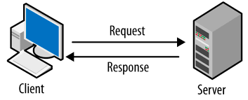

# Understanding Client Server Architecture With MySQL As RDBMS

# Introduction
When we talk the word client, it mean to talk of a person using a particular service. Similarly in the digital world a client can be a  computer or mobile phone capable of receiving information through a medium which can be a web browser or a terminal from a server.
The word server means a medium or a person that serves something. In the real world, a Server is a remote computer which provides information or access to particular services.

So it can basically be said that a client requests and a server respond. 

The image below shows a simple client server architecture.

As we proceed is this project, we will understand more about a [client server architecture](https://en.wikipedia.org/wiki/Client%E2%80%93server_model) and also implement a client server architecture with mysql as a relational database management system.

### Client Server Architecture With MySQL

MySQL is a relational database management system (RDBMS) developed by Oracle that is based on structured query language (SQL). Asw a devops engineer, a knowledge of a RDMS such as [MySQL](https://en.wikipedia.org/wiki/MySQL) is needed.

Now that we have an understanding of a client server architecture, a client server architecture with mysql means using mysql as a client as well as a server.

In some of our previous projects like LAMP and LEMP stack, we implemented, a client server architecture wherby our webserver is a client such that it sends a request to our database server to get a response (data). The architecture is shown inthe image below

